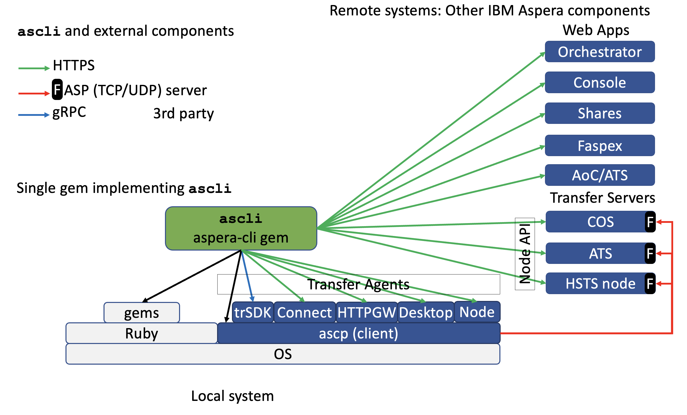

# Contributing
<!-- cspell:words passin -->
## Reporting Issues and Vulnerabilities

You can report issues at <https://github.com/IBM/aspera-cli/issues>

Before you go ahead please search existing issues for your problem.

To make sure that we can help you quickly please include and check the following information:

- Include the `ascli` version you are running in your report.
- If you are not running the latest version (please check), update.
- Include your `ruby -e "puts RUBY_DESCRIPTION"`.

Thanks!

## Making Contributions

To fetch & test the gem for development, do:

```bash
git clone https://github.com/IBM/aspera-cli.git
cd aspera-cli
bundle install
make test
```

If you want to contribute, please:

- Fork the project.
- Make your feature addition or bug fix.
- Add tests for it. This is important so I don't break it in a future version unintentionally.
- **Bonus Points** go out to anyone who also updates `CHANGELOG.md` :)
- Send a pull request on GitHub.
- run `rubocop` to comply for coding standards

## Architecture

A list of classes are provided in <docs/ml.png>

Architecture:



The entry point is: `lib/aspera/cli/main.rb`.

Plugins are located in: `lib/aspera/cli/plugins`.

Transfer agents, in: `lib/aspera/fasp`.

## Ruby version

Install ruby with [RVM](https://rvm.io).

Cleanup installed gems in `rvm` to start fresh:

```bash
make cleanup_gems
```

## Tool chain

TODO: document installation of tool chain.

### Documentation

Documentation is generated with `pandoc` and `LaTeX`.

IBM font `Plex` is used, for installation see [IBM Plex](https://www.ibm.com/plex/).

On macOS to install `lualatex` and all packages:

```bash
brew install texlive
```

If `lualatex` is installed using another method, ensure that the following packages are installed:

```bash
tlmgr update --self
tlmgr install fvextra selnolig lualatex-math
```

## Running Tests

First, a testing configuration file must be created, from project top folder:

```bash
mkdir ~/some_secure_folder
cp docs/test_env.conf ~/some_secure_folder/.
```

Fill `~/some_secure_folder/test_env.conf` with system URLs and credentials for tests.

Then tell where this file is located:

```bash
export ASPERA_CLI_TEST_CONF_FILE=~/some_secure_folder/test_env.conf
```

This project uses a `Makefile` for tests:

```bash
make test
```

When new commands are added to the CLI, new tests shall be added to the test suite.

### Special tests

Some gems are optional: `rmagick` and `grpc`, as they require compilation of native code which may cause problems.
By default, tests that use those gems are skipped.
To run them: `make optional`.
Those tests also require the optional gems to be installed: `make install_optional_gems`.

Some other tests require interactive input. To run them: `make interactive`

To run every test: `make full`

### Pre-release tests

For preparation of a release, do the following:

1. Select a ruby version to test with: `rvm use 3.2.2`
2. Remove all gems: `make clean_gems`
3. Starts tests: `make test`
4. Install optional gems: `make install_optional_gems`
5. Test remaining cases: `cd tests` and then `make optional` and `make interactive`

This ensures that optional gems do not prevent `ascli` to run.

To test additional Ruby version, repeat the procedure with other Ruby versions.

## Coverage

A coverage report can be generated in folder `coverage` using gem `SimpleCov`.
Enable coverage monitoring using env var `ENABLE_COVERAGE`.

```bash
ENABLE_COVERAGE=1 make test
```

Once tests are completed, or during test, consult the page: [coverage/index.html](coverage/index.html)

## Build

By default the gem is built signed: `make`.
The appropriate signing key is required, and its path must be set to env var `SIGNING_KEY`.
It is also possible to build a non-signed version for development purpose: `make unsigned_gem`.

### Gem Signature

Refer to:

- <https://guides.rubygems.org/security/>
- <https://ruby-doc.org/current/stdlibs/rubygems/Gem/Security.html>
- `gem cert --help`

Then procedure is as follows:

- The maintainer creates the initial certificate and a private key:

  ```bash
  cd /path/to/vault
  gem cert --build maintainer@example.com
  ```

  > **Note:** The email must match the field `spec.email` in `aspera-cli.gemspec`

  This creates two files in folder `/path/to/vault` (e.g. $HOME/.ssh):
  
  - `gem-private_key.pem` : This file shall be kept secret in a vault.
  - `gem-public_cert.pem` : This file is copied to a public place, here in folder `certs`

  > **Note:** Alternatively, use an existing key or generate one, and then `make new-cert`

- The maintainer builds the signed gem.

  The gem is signed with the public certificate found in `certs` and the private key (kept secret by maintainer).

  To build the signed gem:

  ```bash
  SIGNING_KEY=/path/to/vault/gem-private_key.pem make
  ```

- The user can activate gem signature verification on installation:

  Add the certificate to gem trusted certificates:

  ```bash
  curl https://raw.githubusercontent.com/IBM/aspera-cli/main/certs/aspera-cli-public-cert.pem -so aspera-cli-certificate.pem
  gem cert --add aspera-cli-certificate.pem
  rm aspera-cli-certificate.pem
  ```

  - The user installs the gem with `HighSecurity` or `MediumSecurity`: this will succeed only of the gem is trusted.

  ```bash
  gem install -P HighSecurity aspera-cli
  ```

  - The maintainer can renew the certificate when it is expired using the same private key:

  ```bash
  SIGNING_KEY=/path/to/vault/gem-private_key.pem make update-cert
  ```

  Alternatively, to generate a new certificate with the same key:

  ```bash
  SIGNING_KEY=/path/to/vault/gem-private_key.pem make new-cert
  ```

  - Show the current certificate contents

  ```bash
  make show-cert
  ```

  > Note: to provide a passphrase add argument: `-passin pass:_value_` to `openssl`

  - Check that the signing key is the same as used to sign the certificate:

  ```bash
  SIGNING_KEY=/path/to/vault/gem-private_key.pem make check-cert-key
  ```

## Docker image build

The `Dockerfile.tmpl.erb` template allows customization of the optional copying of the `aspera-cli.gem` file, as opposed to installing from rubygems.org. It also supports customizing the retrieval of the SDK.

### Default image build

Build the image:

```bash
make docker
```

This does the following:

- Install the official gem version directly from <rubygems.org>.
- Build the image for the version number in the current repository
- creates tags for both the version and `latest`

> **Note:** This target creates the `Dockerfile` from an `ERB` (embedded Ruby) template (Makefile target `dockerfile`).
A template is used as it allows some level of customization to tell where to take the gem from, as as for the SDK file.

Then, to push to the image registry (both tags: version and `latest`):

```bash
make docker_push
```

### Specific version image build

To build a specific version: override `make` macro `GEM_VERSION`:

```bash
make docker GEM_VERSION=4.11.0
make docker_push GEM_VERSION=4.11.0
```

> **Note:** This does not use the locally generated gem file.
Only the local docker file is used.
The gem is installed from rubygems.org. This also sets the `latest` tag.

### Development version image build

To build/push a beta/development container:
it does not create the `latest` tag, it uses the gem file generated locally with a special version number.

```bash
make docker_beta
make docker_push_beta
```

## Single executable build

Initially, `rubyc` (gem [`ruby-packer`](https://github.com/pmq20/ruby-packer) and [here](https://github.com/you54f/ruby-packer)) was used to build a single executable.

<https://www.tebako.org/>

A modern version of this is now used: [`tebako`](https://github.com/tamatebako/tebako) for which a container is provided.

```bash
make single GEM_VERSION=4.11.0
```

## Long Term Implementation and delivery improvements

- replace rest and oauth classes with ruby standard gems:
  - <https://github.com/rest-client/rest-client>
  - <https://github.com/oauth-xx/oauth2>
- use gem Thor <http://whatisthor.com/> (or other standard Ruby CLI manager)
- Package a single-file executable for various architectures with <https://github.com/pmq20/ruby-packer> (`rubyc`)
- look at <https://github.com/phusion/traveling-ruby>
