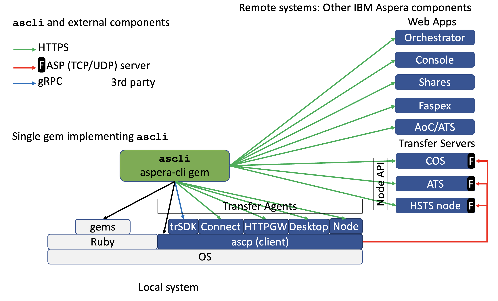

# Contributing

## Reporting Issues and Vulnerabilities

If you encounter a bug or a security vulnerability, please report it via [GitHub Issues](https://github.com/IBM/aspera-cli/issues).

Before submitting a new report:

- **Search existing issues** to determine if the problem has already been documented or resolved.

To help us diagnose and resolve the issue efficiently, please include the following in your report:

- The `ascli` version you are using:

  ```bash
  ascli -v
  ```

- **Update confirmation**: Verify that you are running the latest version.

- **Your Ruby environment details**:

  ```bash
  ruby -v
  ```

## Making Contributions

We welcome contributions to improve the `aspera-cli` project!

### Getting Started

Clone the repository to initialize the development environment:

```bash
git clone https://github.com/IBM/aspera-cli.git
cd aspera-cli
bundle install
bundle exec rake -T
```

For detailed testing instructions, please refer to [Running Tests](#running-tests).

### How to Contribute

To submit a contribution, follow these steps:

1. **Fork** the repository on GitHub.

1. **Create a feature branch** specifically for your changes.

1. **Implement** your feature or bug fix.

1. **Write tests** to ensure your changes are robust and prevent regressions.

1. **Run** `rubocop` to ensure your code adheres to the Ruby style guide.

1. **Update** `CHANGELOG.md` with a concise summary of your changes.

1. **Submit a pull request** with a detailed description of your work.

> [!TIP]
> Keep pull requests focused; include only changes relevant to the specific feature or fix.

## Architecture

The `aspera-cli` architecture is designed to be modular and extensible.



### Structure Highlights

- **Entry Point**:

  `lib/aspera/cli/main.rb` contains the core CLI startup logic.

- **Plugins**:

  Located in `lib/aspera/cli/plugins`, these extend CLI functionality and encapsulate specific features.

- **Transfer Agents**:

  Located in `lib/aspera/agent`, these components manage data transfer operations.

Detailed class diagrams are available in <docs/uml.png>

## Ruby Environment

`aspera-cli` is built with Ruby.
You can manage your Ruby installation using your preferred tool (e.g., `rbenv`, `rvm`, or a system package manager).

To start with a clean state and remove all installed gems:

```bash
bundle exec rake tools:clean_gems
```

> [!TIP]
> This is particularly useful when testing across different Ruby versions or preparing for a new release.

## Toolchain

The build system is powered by Ruby's `rake`.

### Environment Configuration

The following environment variables and macros control specific build behaviors:

| Environment variable        | Contents   | Description                                                  |
|-----------------------------|------------| -------------------------------------------------------------|
| `ASPERA_CLI_TEST_CONF_URL`  | URL        | URL for the configuration file containing secrets for tests. |
| `ASPERA_CLI_DOC_CHECK_LINKS`| yes/no     | Validates that links exist during documentation generation.  |
| `LOG_SECRETS`               | yes/no     | Toggles the logging of secrets in `rake` tasks.              |
| `LOG_LEVEL`                 | debug, ... | Sets the logging verbosity for `rake` tasks.                 |
| `ENABLE_COVERAGE`           | set/unset  | Enables test coverage analysis when defined.                 |
| `SIGNING_KEY`               | File path  | Path to the signing key used for building the gem file.      |
| `SIGNING_KEY_PEM`           | PEM Value  | The PEM content of the signing key.                          |

These values can be set as standard environment variables or passed directly to the `rake` command.

Setting `SIGNING_KEY_PEM` automatically generates a file at `$HOME/.gem/signing_key.pem` and sets the `SIGNING_KEY` variable accordingly.

> [!NOTE]
> `ASPERA_CLI_*` variables are typically defined in your shell profile for development, while others are intended for ad-hoc command-line use.

To run the CLI directly from your source directory, add the following to your shell profile (adjust the path as necessary):

```bash
dev_ascli=$HOME/github/aspera-cli
export PATH=$dev_ascli/bin:$PATH
export RUBYLIB=$dev_ascli/lib:$RUBYLIB
```

### Documentation

Documentation is generated with `pandoc` and `LaTeX`.

The project utilizes the **IBM Plex font**.
Installation instructions can be found at [IBM Plex](https://www.ibm.com/plex/).

On macOS, install `lualatex` and required packages via Homebrew:

```bash
brew install texlive
```

If using an alternative installation method, ensure the following packages are present:

```bash
tlmgr update --self
tlmgr install fvextra selnolig lualatex-math
```

- To validate URLs during generation: `ASPERA_CLI_DOC_CHECK_LINKS=1`.

- To debug the generation process: `ASPERA_CLI_DOC_DEBUG=debug`.

- To build the documentation:

```bash
rake doc:build
```

## Test Environment

Detailed testing information can be found in <tests/README.md>.

## Build

To build an unsigned gem:

```bash
bundle install
bundle exec rake unsigned
```

To exclude optional gems from the installation:

```bash
bundle config set without optional
```

### Signed gem

Generating a signed gem requires a **private key**, specified via the `SIGNING_KEY` environment variable.
The gem is signed using the public certificate in `certs` and the **private key**.

```bash
bundle exec rake SIGNING_KEY=/path/to/vault/gem-private_key.pem
```

For more details, see <certs/README.md>.

### gRPC stubs for Transfer SDK

To update the stubs:

```bash
bundle exec rake tools:grpc
```

This task downloads the latest `.proto` files and compiles them into the Ruby source files included in the repository.

## Container image build

Refer to the [Container build guide](./container/README.md).

## Single executable build

Refer to the [Executable build guide](build/binary/README.md).

To list related `rake` tasks:

```bash
bundle exec rake -T ^binary:
```

## Release

### Branching Strategy

This project maintains a single `main` branch.
During development, the version in `lib/aspera/cli/version.rb` includes a `.pre` suffix (e.g., `x.y.z.pre`).

Contributions are handled as follows:

- **Direct commits** to `main`: Permitted for minor changes.

- **Feature branches**: Required for significant changes via pull requests.

### Pre-Release Checklist

Before a new release, ensure the following:

- **Pass all tests**:

```bash
bundle exec rake test:run
```

- **Verify container builds** (using the local gem):

```bash
bundle exec rake container:build'[local]'
bundle exec rake container:test
```

### Automated Release Process

Releases are managed through the GitHub Actions UI via the **New Release on GitHub** workflow (`.github/workflows/release.yml`).

1. Navigate to **Actions** > **New Release on GitHub**
2. Select **Run workflow**
3. (Optionally) Specify:
   - **Release version**: Defaults to the current `version.rb` value (minus the `.pre` suffix).

     e.g. current `a.b.c.pre` &rarr; `a.b.c`.
   - **Next development version**: Defaults to an incremented minor version with the `.pre` suffix.

     e.g. release `a.b.c` &rarr; `a.(b+1).0.pre`.
4. Click **Run workflow**

The automated workflow performs the following:

1. Updates `version.rb` to the release version
2. Rebuilds all documentation (PDF and Markdown)
3. Commits the changes
4. Creates and pushes the release tag
5. Triggers the `deploy` workflow to publish to [rubygems.org](https://rubygems.org/gems/aspera-cli)
6. Increments `version.rb` to the next development version.
7. Commits and pushes the version bump to `main`.

### Manual Release Process (Alternative)

If necessary, you can mirror the automated process manually:

- Update the version in `lib/aspera/cli/version.rb` (remove `.pre` suffix)

- Build the PDF manual:

```shell
bundle exec rake doc:build
```

- Build the signed gem:

```shell
bundle exec rake SIGNING_KEY=/path/to/vault/gem-private_key.pem
```

- Tag the release and push to GitHub:

```shell
bundle exec rake release_tag
```

This triggers the `.github/workflows/deploy.yml` action to publish to RubyGems.

- Update `version.rb` to the next `.pre` development version.

## Future Improvements

- Evaluate replacing custom REST and OAuth implementations with standard gems:
  - [rest-client](https://github.com/rest-client/rest-client)
  - [oauth2](https://github.com/oauth-xx/oauth2)
- Integrate `thor` <http://whatisthor.com/> or another standard Ruby CLI framework.
- Explore [Traveling Ruby](https://github.com/phusion/traveling-ruby) for distribution.
