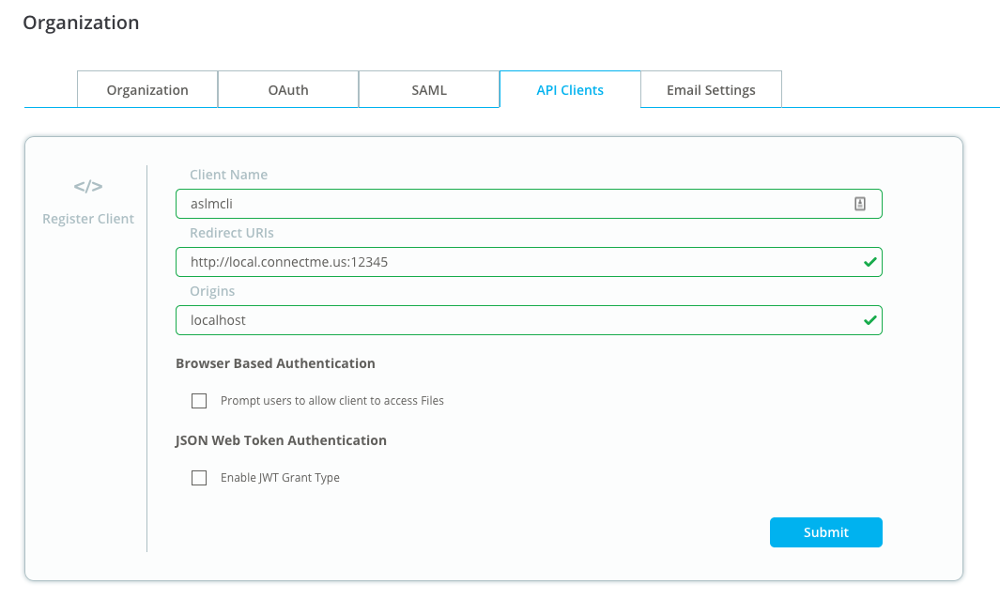
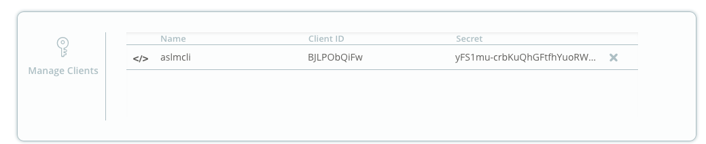
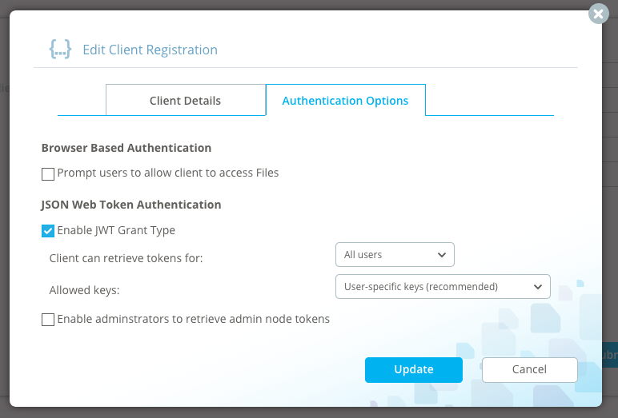
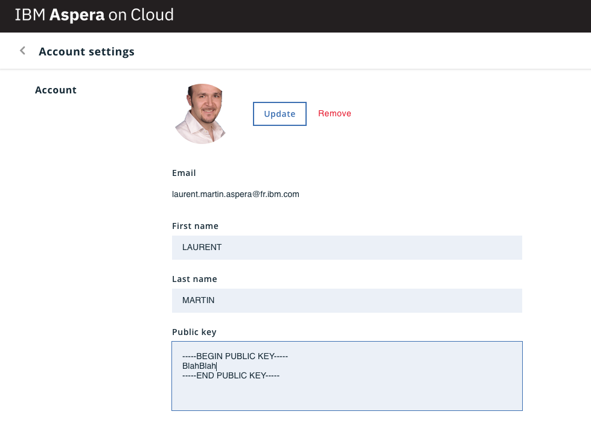

# Asperalm - Laurent&apos;s Aspera Command Line Interface and Ruby Library

Version : <%= `#{ENV["ASCLI"]} --version` %>

_Laurent/2016-2018_

This gem provides a ruby API to Aspera transfers and a command line interface to Aspera Applications.

Disclaimers:

* Aspera, FASP are owned by IBM 
* This GEM is not endorsed/supported by IBM/Aspera
* Use at your risk (not in production environments)
* This gem is provided as-is, and is not intended to be 
a complete CLI, or industry-grade product.
* IBM provides an officially supported Aspera CLI: [http://downloads.asperasoft.com/en/downloads/62](http://downloads.asperasoft.com/en/downloads/62) .

That being said, the aslmcli tool is very powerful and gets things done, it&apos;s also a great tool to learn Aspera APIs.

This manual addresses three parts:

* `aslmcli` tool
* `asession` tool
* `Asperalm` ruby module

In examples, command line operations (starting with `$`) are shown using a standard shell: `bash`.

# Quick Start

To quick start using the `aslmcli` tool, follow the section: [Installation](#installation) (Ruby, Gem, FASP).

Once the gem is installed, the `aslmcli` shall be accessible:

```bash
$ aslmcli --version
x.y.z
```

Then, follow the section relative to the product you want to inbteract with: Files, Faspex, ...

Detailed generic information on configuration can be found in section: [aslmcli](#aslmcli).

# <a name="installation"></a>Installation

In order to use the tool or the gem, it is necessary to install those components:

* ruby
* asperalm
* fasp

The following sections provide information on the installation.

## Ruby

A ruby interpreter is required to run the tool or to use the gem. It is also required to have privilege to install gems.

Ruby 2.4+ is prefered, but it should also work with 2.0+.

Refer to the following sections for specific operating systems.

### macOS

Ruby comes pre-installed on macOS, but the version is not the latest. Also, installion of new gems on pre-installed ruby requires admin privilege (sudo).

It is better to install "homebrew", from here: [https://brew.sh/](https://brew.sh/), and then install Ruby:

```bash
$ brew install ruby
```

### Windows

On windows you can get it from here: [https://rubyinstaller.org/](https://rubyinstaller.org/).

### Linux

```bash
$ yum install ruby rubygems
```

Note that Ruby 2+ is required, if you have an older Linux (e.g. CentOS 6), you should install "rvm" [https://rvm.io/](https://rvm.io/) and install and use a newer Ruby.

## `asperalm` gem

Once you have ruby and rights to install gems: Install the gem and its dependencies:

```bash
$ gem install asperalm
```

## FASP

For FASP based file transfer, the FASP protocol and a valid license 
is required. If the server side is "connect" enabled, one can use 
the connect client license.

`aslmcli` will detect most of Aspera transfer products in standard locations and use the first one found.

Aspera Connect Client can be installed
by visiting the page: [http://downloads.asperasoft.com/connect2/](http://downloads.asperasoft.com/connect2/)

It is also possible to use the `ascp` binary from Aspera CLI, or any other transfer product (High Speed Transfer Server, etc...).

The connect client can be downloaded on command line using `aslmcli`, 
see section: [Client](client).

# <a name="aslmcli"></a>Tool: `aslmcli`

The `asperalm` Gem provides a command line interface (CLI) which interacts with Aspera Products (mostly APIs using REST calls):

* Server
* Node
* Shares
* Faspex
* Console
* Orchestrator
* Files
* ATS
* and more...

`aslmcli` provides the following features:

* Supports most Aspera server products (on-premise and SaaS)
* Command options can be provided on command line, in configuration file, in env var, in files (products URL, credentials or any option)
* Commands, Option values and Parameters can be provided in short format (must be unique)
* FASP [transfer agent](#agents) can be: FaspManager (local ascp), or Connect Client, or a transfer node
* Transfer parameters can be altered by modification of transferspec, this includes requiring multi-session transfer on nodes
* Allows transfers from products to products, essentially at node level (using the node transfer agent)
* Supports FaspStream creation (using Node API)
* Supports Watchfolder creation (using Node API)
* Additional command plugins can be written by the user
* Supports download of faspex and Files "external" links
* Supports "legacy" ssh based FASP transfers and remote commands (ascmd)

Basic usage is displayed by executing:

```bash
$ aslmcli -h
```

Refer to sections: [Usage](#usage) and [Sample Commands](commands).

Not all `aslmcli` features are fully documented here, the user may explore commands on the command line.

## Commands, Arguments and Options

Commands, Options and Arguments are typically provided on command line, e.g. in:

```
$ aslmcli command --option-name=VAL1 VAL2
```

* executes action: `command`
* with one option: `option_name`
* this option has a value of: `VAL1`
* the command has one argument: `VAL2`

When the value of a command, option or argument is constrained by a fixed list of values, it is possible to use the first letters of the value only, provided that it uniquely identifies a value. For example `aslmcli conf ov` is the same as `aslmcli config overview`.

The value of options and arguments is evaluated with the [Extended Value Syntax](#extended).

### Options

Options are command line arguments starting with a `-`. Options can be optional or mandatory, with or without (hardcoded) default value. Most options take a value, but a limited number of them are without values (e.g. `-r`). Options can be placed anywhere on comand line and evaluated in order.

The special option "--" is ignored but stops option processing, subsequent values are taken as arguments, including the ones starting with a `-`.

The value for _any_ options can come from the following locations:

* Command line
* [Configuration file](#configfile).
* Environment variable

Environment variable starting with prefix: ASLMCLI_ are taken as option values, 
i.e. `ASLMCLI_OPTION_NAME` is for `--option-name`.

Options values can be displayed for a given command by providing the `--show-config` option: `aslmcli node --show-config`

Evaluation of a parameter value follow this order:

* configuration file
* environment variable
* command line

The last value evaluated is the one taken.

### Commands and Arguments

Command line arguments not starting with `-` are either commands or arguments (as well as command line arguments following `--`).

## Interactive Input

Some options and parameters are mandatory and other optional. By default, the tool will ask for missing mandatory options or parameters for interactive execution.

The behaviour can be controlled with:

* --interactive=&lt;yes|no&gt; (default=yes if STDIN is a terminal, else no)
   * yes : missing mandatory parameters/options are asked to the user
   * no : missing mandatory parameters/options raise an error message
* --ask-options=&lt;yes|no&gt; (default=no)
   * optional parameters/options are asked to user

## <a name="extended"></a>Extended Value Syntax

Usually, values of options and arguments are specified by a simple string. But sometime it is convenient to read a value from a file, or decode it, or have a value more complex than a string (e.g. Hash table).

The value of options and arguments can optionally be retrieved using one of the following "readers":

* @val:VALUE , prevent further special prefix processing, e.g. `--username=@val:laurent` sets the option `username` to value `laurent`.
* @file:PATH , read value from a file (prefix "~/" is replaced with the users home folder), e.g. --key=@file:~/.ssh/mykey
* @env:ENVVAR , read from a named env var, e.g.--password=@env:MYPASSVAR

In addition it is possible to decode a value, using one or multiple decoders :

* @base64: decode a base64 encoded string
* @json: decode JSON values (convenient to provide complex structures)
* @zlib: uncompress data
* @ruby: execute ruby code
* @csvt: decode a titled CSV value

To display the result of an extended value, use the `config echo` command.

Example: read the content of the specified file, then, base64 decode, then unzip:

```bash
$ aslmcli config echo @zlib:@base64:@file:myfile.dat
```

Example: create a value as a hash, with one key and the value is read from a file:

```bash
$ aslmcli config echo @ruby:'{"token_verification_key"=>File.read("pubkey.txt")}' 
```

Example: read a csv file and create a list of hash for bulk provisioning:

```bash
$ cat test.csv 
name,email
lolo,laurent@example.com
toto,titi@tutu.tata
$ aslmcli config echo @csvt:@file:test.csv
:......:.....................:
: name :        email        :
:......:.....................:
: lolo : laurent@example.com :
: toto : titi@tutu.tata      :
:......:.....................:
```

## <a name="native"></a>Structured Value

Some options and parameters expect a _Structured Value_, i.e. a value more complex than a simple string. This is usually a Hash table or an Array, which could also contain sub structures.

For instance, a [_transfer-spec_](#_transferspec_) is expected to be a _Structured Value_.

Structured values shall be described using the [Extended Value Syntax](#extended).
A convenient way to specify a _Structured Value_ is to use the `@json:` decoder, and describe the value in JSON format. The `@ruby:` decoder can also be used. For an array of hash tables, the `@csvt:` decoder can be used.

It is also possible to provide a _Structured Value_ in a file using `@json:@file:<path>`

## <a name="configfile"></a>Configuration file

`aslmcli` configuration and cache files are stored in folder `$HOME/.aspera/aslmcli`.

A configuration file is created with configuration modification commands. There is no mandatory information required in this file. It is mainly used to define pre-sets of command options.

All options can be set on command line, or by env vars, or in the configuratin file.
A configuration file provides a way to define default values, especially
for authentication parameters, thus avoiding to always have to specify those parameters on the command line.

The default configuration file is: `$HOME/.aspera/aslmcli/config.yaml` 
(this can be overriden with option `--config-file=path`).

It is composed of _option presets_ containing pre-sets for options.

### Creation and Modification of _option presets_

The configuration file can be modified using the following commands:

```
aslmcli config id <option preset> set|delete|show|initialize|update
```

The command `update` allows the easy creation of option preset by simply providing the options in their command line format, e.g. :

```
aslmcli config id node_to_node update --url=https://10.25.0.4:9092 --username=node_user --password=node_pass --ts=@json:'{"precalculate_job_size":true}' --transfer=node --transfer-node=@json:'{"url":"https://10.25.0.8:9092","username":"node_user2","password":"node_pass2"}'
```

* This creates a _option preset_ `node_to_node` with all provided options.

The command `set` allows setting individual options in a _option preset_.

The command `initialize`, like `update` allows to set several parameters at once, but it deletes an existing configuration instead of updating it, and expects a _[Structured Value](#native)_.

A good practice is to not manually edit this file and use modification commands.
If necessary, the configuration file can be edited (or simply consulted) with:

```bash
$ aslmcli config open
```

A full terminal based overview of the configuration can be displayed using:

```bash
$ aslmcli config over
```


### Format

The configuration file is a hash in a YAML file. Example:

```yaml
config:
  version: 0.3.7
  loglevel: debug
default:
  faspex: myfaspparams
myfaspparams:
  url: https://faspex.my.org/aspera/faspex
  username: admin
  password: MyPassword
```
* The configuration was created with CLI version 0.3.7
* the log level is set to `debug`
* the default option preset to load for plugin "faspex" is : myfaspparams
* the option preset "myfaspparams" defines some parameters: the URL and credentials

Configuation is organized in _option presets_, like in `.ini` files. Each group has a name contains option name-value pairs.

Two _option presets_ are reserved:

* `config` is reserved for the global parameters of the `aslmcli` tool.
It contains a special parameter: "version" showing the CLI 
version used to create this file. It is used to check compatibility.
* `default` is reserved to define the default option preset name used for plugins.

The user may create as many _option presets_ as needed. For instance, a particular _option preset_ can be created for a particular application instance and contain URL and credentials.


Values in the configuration also follow the [Extended Value Syntax](#extended).

Note: if the user wants to use the [Extended Value Syntax](#extended) inside the configuration file, using the `config id update` command, the user shall use the `@val:` prefix. Example:

```bash
$ aslmcli config id my_files_org set private_key @val:@file:"$HOME/.aspera/aslmcli/filesapikey"
```

This creates the _option preset_:

```
...
my_files_org:
  private_key: @file:"/Users/laurent/.aspera/aslmcli/filesapikey"
...
```

So, the key file will be read only at execution time, but not be embedded in the configuration file.

Options are loaded using this algorithm:

* if option '--load-params=xxxx' is specified (or -Pxxxx), this reads the option preset specified from the configuration file.
    * else if option --no-default is specified, then dont load default
    * else it looks for the name of the default option preset in section "default" and loads it
* environment variables are evaluated
* command line options are evaluated

Parameters are evaluated in the order of command line.

To avoid loading the default option preset for a plugin, just specify a non existing configuration: `-Pnone`

On command line, words in parameter names are separated by a dash, in configuration file, separator
is an underscore. E.g. --transfer-name  on command line gives transfer_node in configuration file.

Note: before version 0.4.5, some keys could be ruby symbols, from 0.4.5 all keys are strings. To
convert olver versions, remove the leading ":" in fronty of keys.

### Examples

For Faspex, Shares, Node (including ATS, Aspera Transfer Service), Console, 
only username/password and url are required (either on command line, or from config file). 
Those can usually be provided on the command line:

```bash
$ aslmcli shares repo browse / --url=https://10.25.0.6 --username=john --password=4sp3ra 
```

This can also be provisioned in a config file:

```bash
1$ aslmcli config id shares06 set url https://10.25.0.6
2$ aslmcli config id shares06 set username john
3$ aslmcli config id shares06 set password 4sp3ra
4$ aslmcli config id default set shares shares06 
5$ aslmcli config show
6$ aslmcli shares repo browse /
```

The three first commands build a option preset. 
Note that this can also be done with one single command:

```bash
$ aslmcli config id shares06 init @json:'{"url":"https://10.25.0.6","username":"john","password":"4sp3ra"}'
```

The fourth command defines this option preset as the default option preset for the 
specified application ("shares"). The 5th command dumps the configuration file. 
Alternative option presets can be used with option "-P&lt;option preset&gt;"
(or --load-params=&lt;option preset&gt;)

Eventually, the last command shows a call to the shares application using default parameters.


## Plugins

The CLI tool uses a plugin mechanism. The first level command (just after `aslmcli` on the command line) is the name of the concerned plugin which will execute the command. Each plugin usually represent commands sent to a specific application.
For instance, the plugin "faspex" allows operations on the application "Aspera Faspex".

### Create your own plugin
```bash
$ mkdir -p ~/.aspera/aslmcli/plugins
$ cat<<EOF>~/.aspera/aslmcli/plugins/test.rb
require 'asperalm/cli/plugin'
module Asperalm
  module Cli
    module Plugins
      class Test < Plugin
        def declare_options; end
        def action_list; [];end
        def execute_action; puts "Hello World!"; end
      end # Test
    end # Plugins
  end # Cli
end # Asperalm
EOF
```

## Learning Aspera Product APIs (REST)

This CLI uses REST APIs.
To display HTTP calls, use argument `-r` or `--rest-debug`, this is useful to display 
exact content or HTTP requests and responses.

In order to get traces of execution, use argument : `--log-level=debug`

## <a name="graphical"></a>Graphical Interactions: Browser and Text Editor

Some actions may require the use of a graphical tool:

* a browser for Aspera Files authentication
* a text editor for configuration file edition

By default the CLI will assume that a graphical environment is available on windows,
and on other systems, rely on the presence of the "DISPLAY" environment variable.
It is also possible to force the graphical mode with option --gui-mode :

* `--gui-mode=graphical` forces a graphical environment, a browser will be opened for URLs or
a text editor for file edition.
* `--gui-mode=text` forces a text environment, the URL or file path to open is displayed on
terminal.

## <a name="agents"></a>Transfer Agents

Some of the actions on Aspera Applications lead to file transfers (upload and download) using the FASP protocol (`ascp`).

This transfer can be done using on of the 3 following methods:

* `direct` for a local execution of `ascp`
* `connect` to make use of a local Connect Client
* `node` to make use of a _remote_ Aspera Transfer Node.

`aslmcli` standadizes on the use of a [_transfer-spec_](#_transferspec_) instead of _raw_ ascp options to provide parameters for a transfer session, as a common method for those three Transfer Agents.

### FASPManager API based (command line)

By default the CLI will use the Aspera Connect Client FASP part, in this case
it requires the installation of the Aspera Connect Client to be 
able to execute FASP based transfers. The CLI will try to automatically locate the 
Aspera Protocol (`ascp`). This is option: `--transfer=ascp`. Note that parameters
are always provided with a [_transfer-spec_](#_transferspec_).

### Aspera Connect Client GUI

By specifying option: `--transfer=connect`, the CLI will start transfers in the Aspera
Connect Client.

### Aspera Node API : Node to node transfers

By specifying option: `--transfer=node`, the CLI will start transfers in an Aspera
Transfer Server using the Node API.

If a default node has been configured
in the configuration file, then this node is used by default else the parameter
`--transfer-node` is required. The node specification shall be a hash table with
three keys: url, username and password, corresponding to the URL of the node API
and associated credentials (node user or access key).

The `--transfer-node` parameter can directly specify a pre-configured option preset : 
`--transfer-node=@param:<psetname>` or specified using the option syntax :
`--transfer-node=@json:'{"url":"https://...","username":"theuser","password":"thepass"}'`

## <a name="transferspec"></a>Transfer Specification

Some commands lead to file transfer (upload/download), all parameters necessary for this transfer
is described in a _transfer-spec_ (Transfer Specification), such as:

* server address
* transfer user name
* credentials
* file list
* etc...

`aslmcli` builds a default _transfer-spec_ internally, so it is not necessary to provide additional parameters on the command line for this transfer.

If needed, it is possible to modify or add any of the supported _transfer-spec_ parameter using the `ts` option. The `ts` option accepts a [Structured Value](#native) containing one or several _transfer-spec_ parameters.

It is possible to specify ascp options when the `transfer` option is set to `direct` using the special [_transfer-spec_](#_transferspec_) parameter: `EX_ascp_args`. Example: `--ts=@json:'{"EX_ascp_args":["-l","100m"]}'`.

The use of a _transfer-spec_ instead of `ascp` parameters has the advantage of:

* common to all [Transfer Agent](#agents)
* not dependant on command line limitations (special characters...)

A [_transfer-spec_](#_transferspec_) is a Hash table, so it is described on the command line with the [Extended Value Syntax](#extended). Keys are described in section [Transfer Parameters](#transferparams).

### <a name="transferparams">Transfer Parameters

All standard [_transfer-spec_](#_transferspec_) parameter can be overloaded. To display parameter,
run in debug mode (--log-level=debug). [_transfer-spec_](#_transferspec_) can also be saved/overridden in
the config file.

(UNDER CONSTRUCTION <a href="https://developer.asperasoft.com/web/node/ops-transfers">ref</a>)

* F=Fasp Manager(local FASP execution)
* N=remote node(node API)
* C=Connect Client(web plugin)

Req/Def : Required or default value (- means emty)

Fields with EX_ prefix are specific to aslmcli in local mode.

arg: related ascp argument or env var suffix (PASS for ASPERA_SCP_PASS)

<style type="text/css">
table {border-collapse: collapse;}
table, th, td {border: 1px solid black;}
.yes {color:white;background-color:green;font-weight:bold;}
.no  {color:white;background-color:red;font-weight:bold;}
</style>
<table>
<tr><th>Field</th><th>Req/Def</th><th>Type</th><th>F</th><th>N</th><th>C</th><th>arg</th><th>Description</th></tr>
<tr><td>direction</td><td>Required</td><td>string</td><td class="yes">Y</td><td class="yes">Y</td><td class="yes">Y</td><td>--mode</td><td>Direction: "send" or "receive"</td></tr>
<tr><td>remote_host</td><td>Required</td><td>string</td><td class="yes">Y</td><td class="yes">Y</td><td class="yes">Y</td><td>--host</td><td>IP or fully qualified domain name of the remote server</td></tr>
<tr><td>remote_user</td><td>Required</td><td>string</td></td><td class="yes">Y</td><td class="yes">Y</td><td class="yes">Y</td><td>--user</td><td>Remote user. Default value is "xfer" on node or connect.</td></tr>
<tr><td>destination_root</td><td>Required</td><td>string</td><td class="yes">Y</td><td class="yes">Y</td><td class="yes">Y</td><td>last arg</td><td>Destination root directory.</td></tr>
<tr><td>title</td><td>-</td><td>string</td><td class="no">N</td><td class="yes">Y</td><td class="yes">Y</td><td>-</td><td>Title of the transfer</td></tr>
<tr><td>tags</td><td>-</td><td>hash</td><td class="yes">Y</td><td class="yes">Y</td><td class="yes">Y</td><td>--tags<br>--tags64</td><td>Metadata for transfer</td></tr>
<tr><td>token</td><td>-</td><td>string</td><td class="yes">Y</td><td class="yes">Y</td><td class="yes">Y</td><td>TOKEN<br/>-W</td><td>Authorization token: Bearer, Basic or ATM</td></tr>
<tr><td>cookie</td><td>-</td><td>string</td><td class="yes">Y</td><td class="yes">Y</td><td class="yes">Y</td><td>COOKIE</td><td>Metadata for transfer (older,string)</td></tr>
<tr><td>remote_access_key</td><td>TODO</td><td>string</td><td></td><td></td><td></td><td>?</td><td>Node only?</td></tr>
<tr><td>source_root</td><td>-</td><td>string</td><td></td><td></td><td></td><td>--source-prefix<br/>--source-prefix64</td><td>Source root directory.(TODO: verify option)</td></tr>
<tr><td>fasp_port</td><td>33001</td><td>integer</td></td><td class="yes">Y</td><td class="yes">Y</td><td class="yes">Y</td><td>-O</td><td>Specifies fasp (UDP) port.</td></tr>
<tr><td>ssh_port</td><td>22 or 33001</td><td>integer</td></td><td class="yes">Y</td><td class="yes">Y</td><td class="yes">Y</td><td>-P</td><td>Specifies ssh (TCP) port.</td></tr>
<tr><td>rate_policy</td><td>server config</td><td>string</td><td class="yes">Y</td><td class="yes">Y</td><td class="yes">Y</td><td>--policy</td><td>Valid literals include "low","fair","high" and "fixed".</td></tr>
<tr><td>symlink_policy</td><td>follow</td><td>string</td><td class="yes">Y</td><td class="yes">Y</td><td class="yes">Y</td><td>--symbolic-links</td><td>copy, follow, copy+force, skip.  Default is follow.  Handle source side symbolic links by following the link (follow), copying the link itself (copy),  skipping (skip), or forcibly copying the link itself (copy+force).</td></tr>
<tr><td>target_rate_kbps</td><td>-</td><td>integer</td><td class="yes">Y</td><td class="yes">Y</td><td class="yes">Y</td><td>-l</td><td>Specifies desired speed for the transfer.</td></tr>
<tr><td>min_rate_kbps</td><td>0</td><td>integer</td><td class="yes">Y</td><td class="yes">Y</td><td class="yes">Y</td><td>-m</td><td>Set the minimum transfer rate in kilobits per second.</td></tr>
<tr><td>cipher</td><td>none</td><td>string</td><td class="yes">Y</td><td class="yes">Y</td><td class="yes">Y</td><td>-c</td><td>in transit encryption type.<br/>none, aes-128, aes-256</td></tr>
<tr><td>content_protection</td><td>encrypt<br/>decrypt</td><td>string</td><td></td><td></td><td></td><td>--file-crypt=</td><td>encryption at rest</td></tr>
<tr><td>content_protection_password</td><td>-</td><td>string</td><td></td><td></td><td></td><td>PASS</td><td>Specifies a string password.</td></tr>
<tr><td>overwrite</td><td>diff</td><td>string</td><td class="yes">Y</td><td class="yes">Y</td><td class="yes">Y</td><td>--overwrite</td><td>Overwrite destination files with the source files of the same name.<br/>never, always, diff, older, or diff+older</td></tr>
<tr><td>retry_duration</td><td></td><td>string</td><td></td><td></td><td></td><td>TODO</td><td>Specifies how long to wait before retrying transfer. (e.g. "5min")</td></tr>
<tr><td>http_fallback</td><td></td><td>bool (node), integer</td><td></td><td></td><td></td><td>-y<br/>TODO</td><td>When true(1), attempts to perform an HTTP transfer if a fasp transfer cannot be performed.</td></tr>
<tr><td>create_dir</td><td></td><td>boolean</td><td class="yes">Y</td><td class="yes">Y</td><td class="yes">Y</td><td>-d</td><td>Specifies whether to create new directories.</td></tr>
<tr><td>precalculate_job_size</td><td>srv. def.</td><td>boolean</td><td class="yes">Y</td><td class="yes">Y</td><td class="yes">Y</td><td>--precalculate-job-size</td><td>Specifies whether to precalculate the job size.</td></tr>
<tr><td>delete_source</td><td></td><td>boolean</td><td></td><td class="yes">Y</td><td></td><td>?</td><td>?</td></tr>
<tr><td>remove_after_transfer</td><td></td><td>boolean</td><td></td><td class="yes">Y</td><td></td><td>?</td><td>Specifies whether to remove file after transfer.</td></tr>
<tr><td>remove_empty_directories</td><td></td><td>boolean</td><td></td><td class="yes">Y</td><td></td><td>?</td><td>Specifies whether to remove empty directories.</td></tr>
<tr><td>multi_session</td><td>1</td><td>integer</td><td class="no">N</td><td class="yes">Y</td><td class="no">N</td><td>-C</td><td>Specifies how many parts the transfer is in.</td></tr>
<tr><td>multi_session_threshold</td><td>null</td><td>integer</td><td class="no">N</td><td class="yes">Y</td><td class="no">N</td><td>-</td><td>in bytes</td></tr>
<tr><td>dgram_size</td><td></td><td>integer</td><td class="yes">Y</td><td></td><td></td><td>-Z</td><td>in bytes</td></tr>
<tr><td>compression</td><td></td><td>integer</td><td></td><td></td><td></td><td></td><td>ascp4 only, 0 / 1?</td></tr>
<tr><td>read_threads</td><td></td><td>integer</td><td></td><td></td><td></td><td>-</td><td>ascp4 only</td></tr>
<tr><td>write_threads</td><td></td><td>integer</td><td></td><td></td><td></td><td>-</td><td>ascp4 only</td></tr>
<tr><td>use_ascp4</td><td>false</td><td>boolean</td><td></td><td class="yes">Y</td><td></td><td>-</td><td>specify version of protocol</td></tr>
<tr><td>paths</td><td>source files (dest)</td><td>array</td><td></td><td></td><td></td><td>positional<br/>--file-list<br/>--file-pair-list</td><td>Contains a path to the source (required) and a path to the destination.</td></tr>
<tr><td>http_fallback_port</td><td></td><td>integer</td><td class="yes">Y</td><td></td><td></td><td>-t</td><td>Specifies http port.</td></tr>
<tr><td>https_fallback_port</td><td></td><td>integer</td><td></td><td></td><td></td><td>todo</td><td>Specifies https port.</td></tr>
<tr><td>cipher_allowed</td><td></td><td>string</td><td></td><td></td><td></td><td>-</td><td>returned by node API. Valid literals include "aes-128" and "none".</td></tr>
<tr><td>target_rate_cap_kbps</td><td></td><td></td><td class="no">N</td><td class="no">?</td><td class="yes">?</td><td>-</td><td>Returned by upload/download_setup node api.</td></tr>
<tr><td>rate_policy_allowed</td><td></td><td></td><td></td><td></td><td></td><td>-</td><td>returned by node API. Specifies most aggressive rate policy that is allowed. Valid literals include "low", "fair","high" and "fixed".</td></tr>
<tr><td>ssh_private_key</td><td></td><td>string</td><td></td><td></td><td></td><td>-</td><td>todo</td></tr>
<tr><td>remote_password</td><td>-</td><td>string</td><td class="yes">Y</td><td class="yes">Y</td><td class="yes">Y</td><td>PASS</td><td>SSH session password</td></tr>
<tr><td>resume_policy</td><td>faspmgr:<br/>none<br/>other:<br/>sparse_csum</td><td>string</td><td class="yes">Y</td><td class="yes">Y</td><td class="yes">Y</td><td>-k</td><td>none,attrs,sparse_csum,full_csum</td></tr>
<tr><td>authentication</td><td>faspmgr:<br/>none<br/>other:<br/>sparse_csum</td><td>string</td><td class="yes">Y</td><td class="yes">Y</td><td class="no">N</td><td>-</td><td>token: Aspera web keys are provided to allow transparent web based session initiation. on connect: password is not asked. Else, password is asked, and keys are not provided.</td></tr>
<tr><td>EX_ssh_key_value</td><td>-</td><td>string</td><td class="yes">Y</td><td class="no">N</td><td class="no">N</td><td>KEY</td><td>Private key used for SSH authentication</td></tr>
<tr><td>EX_ssh_key_paths</td><td>-</td><td>array</td><td class="yes">Y</td><td class="no">N</td><td class="no">N</td><td>-i</td><td>Use public key authentication and specify the private key file</td></tr>
<tr><td>EX_fallback_key</td><td>-</td><td>string</td><td class="yes">Y</td><td class="no">N</td><td class="no">N</td><td>-Y</td><td>The HTTPS transfer&apos;s key file name</td></tr>
<tr><td>EX_fallback_cert</td><td>-</td><td>string</td><td class="yes">Y</td><td class="no">N</td><td class="no">N</td><td>-I</td><td>The HTTPS certificate&apos;s file name</td></tr>
<tr><td>EX_at_rest_password</td><td>-</td><td>string</td><td class="yes">Y</td><td class="no">N</td><td class="no">N</td><td>FILEPASS</td><td>Passphrase used for at rest encryption or decryption</td></tr>
<tr><td>EX_proxy_password</td><td>-</td><td>string</td><td class="yes">Y</td><td class="no">N</td><td class="no">N</td><td>PROXY_PASS</td><td>TODO</td></tr>
<tr><td>EX_quiet</td><td>-</td><td>boolean</td><td class="yes">Y</td><td class="no">N</td><td class="no">N</td><td>-q</td><td>Quiet flag, disable progress display</td></tr>
<tr><td>EX_fasp_proxy_url</td><td>-</td><td>string</td><td class="yes">Y</td><td class="no">N</td><td class="no">N</td><td>--proxy</td><td>Specify the address of the Aspera high-speed proxy server</td></tr>
<tr><td>EX_http_proxy_url</td><td>-</td><td>string</td><td class="yes">Y</td><td class="no">N</td><td class="no">N</td><td>-x</td><td>Specify the proxy server address used by HTTP Fallback</td></tr>
<tr><td>EX_ascp_args</td><td>-</td><td>array</td><td class="yes">Y</td><td class="no">N</td><td class="no">N</td><td>same</td><td>Add command line arguments to ascp</td></tr>
<tr><td>EX_http_transfer_jpeg</td><td>0</td><td>integer</td><td class="yes">Y</td><td class="no">N</td><td class="no">N</td><td>-j</td><td>HTTP transfers as JPEG file</td></tr>
</table>

### Destination folder for transfers

The destination folder is set by `aslmcli` by default to:

* `.` for downloads
* `/` for uploads

It is specified by the [_transfer-spec_](#_transferspec_) parameter `destination_root`. As such, it can be modified with option: `--ts=@json:'{"destination_root":"<path>"}'`.
The option `to_folder` provides a convenient way to change this parameter:  `--to-folder=<path>` and is equivalent.

### Examples

* Change target rate

```bash
--ts=@json:'{"target_rate_kbps":500000}'
```

* Override the FASP SSH port to a specific TCP port:

```bash
--ts=@json:'{"ssh_port":12345}'
```

* Force http fallback mode:

```bash
--ts=@json:'{"http_fallback":"force"}'
```

* Use multi-session transfer (when agent=node)

```bash
--ts=@json:'{"multi_session":10,"multi_session_threshold":1}'
```

## Exclusive execution

If it is required to run a command as a single instance, it is possible to protect with parameter: `--lock-port=nnnn`.

This opens a local TCP server port, and fails if this port is already used, providing a local lock.

This option is used when the tools is executed automatically, for instance with "preview" generatin.

## <a name="commands"></a>Sample Commands
A non complete list of commands used in unit tests:

```bash
<%= File.read(ENV["COMMANDS"]) %>
...and more
```

## <a name="usage"></a>Usage

```bash
$ aslmcli -h
<%= File.read(ENV["USAGE"]) %>

```

Note that actions and parameter values can be written in short form.


# Application Plugins

`aslmcli` comes with several Aspera application plugins.

## General: Application URL and Authentication

REST APIs of Aspera legacy applications (Aspera Node, Faspex, Shares, Console, Orchestrator, Server) use simple username/password authentication: HTTP Basic Authentication. 

Those are using options:

* url
* username
* password

Those can be provided using command line, parameter set, env var, see section above.

Aspera Files relies on Oauth, refer to the [Aspera Files](#files) section.

## <a name="files"></a>Aspera Files, Aspera on Cloud

Aspera Files uses the more advanced Oauth mechanism for authentication (HTTP Basic authentication is not supported).
This requires additional setup.
Several types of OAuth authentication are supported:

* Web based authentication : authentication is made by user using a browser (simpler)
* JSON Web Token (JWT) : authentication is secured by a private key (recommended)
* URL Token : external users authentication with url tokens (external links)

The authentication method is controled by option `auth`.

For a _quick start_, follow the mandatory and sufficient section: [API Client Registration](#clientreg) (auth=web) as well as [Option Preset for Files](#filespreset).

For a more convenient, browser-less, experience follow the [JWT](#jwt) section (auth=jwt) in addition to Client Registration.

In Oauth, a "Bearer" token are generated to authenticate REST calls. Bearer tokens are valid for a period of time.`aslmcli` saves generated tokens in its configuration folder, tries to re-use them or regenerates them when they have expired.

### <a name="clientreg"></a>API Client Registration

The first step is to declare `aslmcli` in Files using the admin interface.

(official documentation: [https://aspera.asperafiles.com/helpcenter/admin/organization/registering-an-api-client](https://aspera.asperafiles.com/helpcenter/admin/organization/registering-an-api-client) ).

Let's start by a registration with web based authentication (auth=web):



* Open a web browser, log to your instance: e.g. `https://laurent.ibmaspera.com/`
* Go to Admin View-Organization-API Clients-Create
* Fill the API client creation form:
	* Client Name: `aslmcli`
	* Redirect URIs: `http://local.connectme.us:12345`
	* Origins: `localhost`
	* uncheck "Prompt users to allow client to access Files"
	* leave JWT unchecked for now
* Submit

Note: for web based authentication, `aslmcli` listens on a local port (here 12345), and the browser will provide the OAuth code there.



Once the client is registered, a "Client ID" and "Secret" are created, these values will be used in the next step.

### <a name="filespreset"></a>Option Preset for Files

It is convenient to save several of those parameters in an option preset for `aslmcli` in its configuration file. Lets create an option preset called: `my_files_org` using `ask` interactive input (client info from previous step):

```
$ aslmcli config id my_files_org ask url client_id client_secret auth redirect_uri
option: url> https://laurent.ibmaspera.com/
option: client_id> BJLPObQiFw
option: client_secret> yFS1mu-crbKuQhGFtfhYuoRW...
option: auth> web
option: redirect_uri> http://local.connectme.us:12345
updated: my_files_org
```

(This can also be done in one line using the command `config id my_files_org update --url=...`)

Define this preset as default configuration for the `files` plugin:

```bash
$ aslmcli config id default set files my_files_org
```

### <a name="filesfirst"></a>First Use

Once client has been registered and option preset created: `aslmcli` can be used:

```bash
$ aslmcli files repo br /
Current Workspace: Default Workspace (default)
empty
```

Note that it requires a web based authentication. Refer to section [Graphical Interactions](#graphical) to customize the way browser is started.

For direct browser-less authentication, follow the [JWT](#jwt) section.

### <a name="jwt"></a>Activation of JSON Web Token (JWT) for direct authentication

In addition to basic API Client registration, the following steps are required for a Browser-less, Key-based authentication.

#### Key Pair Generation

In order to use JWT for Aspera Files API client authentication, 
a private/public key pair must be generated (without passphrase)
This can be done using any of the following method:

(TODO: add passphrase protection as option).

* using the CLI:

```bash
$ aslmcli config genkey ~/.aspera/aslmcli/filesapikey
```

* `ssh-keygen`:

```bash
$ ssh-keygen -t rsa -f ~/.aspera/aslmcli/filesapikey -N ''
```

* `openssl`

(on some openssl implementation (mac) there is option: -nodes (no DES))

```bash
$ APIKEY=~/.aspera/aslmcli/filesapikey
$ openssl genrsa -passout pass:dummypassword -out ${APIKEY}.protected 2048
$ openssl rsa -passin pass:dummypassword -in ${APIKEY}.protected -out ${APIKEY}
$ openssl rsa -pubout -in ${APIKEY} -out ${APIKEY}.pub
$ rm -f ${APIKEY}.protected
```

#### API Client JWT activation

JWT needs to be authorized in Files. This can be done in two manners:

##### Graphically



* Open a web browser, log to your instance: https://laurent.ibmaspera.com/
* Go to Admin View-Organization-API Clients
* Click on the previously created application
* select tab : "Authentication Options"
* Modify options:
	* activate "Enable JWT Grant Type"
	* Client can retrieve tokens for: All Users
	* Allowed keys: keep "User-specific keys"
	* Enable admin tokens

Note: It is also possible to allow a "super key" to impersonate any user by registering a "super key" at this step. (Select USer and Global, and then set public key).

##### Using command line

```bash
$ aslmcli files admin res client list
:............:.........:
:     id     :  name   :
:............:.........:
: BJLPObQiFw : aslmcli :
:............:.........:
$ aslmcli files admin res client --id=BJLPObQiFw modify @json:'{"jwt_grant_enabled":true,"explicit_authorization_required":false}'
modified
```

#### User key registration

The public key must be assigned to your user. This can be done in two manners:

##### Graphically



* Open a web browser, log to your instance: https://laurent.ibmaspera.com/
* In User Admin View, click n the user's icon (top right)
* Select "Account Settings"
* Paste the _Public Key_ in the "Public Key" section
* Click on "Update"

##### Using command line

```bash
$ aslmcli files admin res user list
:........:................:
:   id   :      name      :
:........:................:
: 109952 : Tech Support   :
: 109951 : LAURENT MARTIN :
:........:................:
$ aslmcli files admin res user --id=109951 modify @ruby:'{"public_key"=>File.read(File.expand_path("~/.aspera/aslmcli/filesapikey.pub"))}'   
modified
```

Note: the `show` command can be used to verify modifications.

#### Preset modification for JWT

To activate JWT authentication for `aslmcli` using the preset, do the folowing:

* change auth method to JWT
* provide location of private key
* provide username to login as (OAuthg "subject")

Execute:

```bash
$ aslmcli config id my_files_org update --auth=jwt --private-key=@val:@file:~/.aspera/aslmcli/filesapikey --username=laurent.martin.aspera@fr.ibm.com
```

Note: the private key argument represents the actual PEM string. In order to read the content from a file, use the @file: prefix. But if the @file: argument is used as is, it will read the file and set in the config file. So to keep the "@file" tag in the configuration file, the @val: prefix is added.

After this last step, commands do not require web login anymore.


### Administration

The `admin` command allows several administrative tasks (and require admin privilege).

It allows actions (create, update, delete) on "resources": users, group, nodes, workspace, etc... with the `admin resource` command.

Bulk operations are possible using option `bulk` (yes,no(default)): currently: create only. In that case, the operation expects an Array of Hash instead of a simple Hash using the [Extended Value Syntax](#extended).

#### Examples

* Bulk creation

```bash
$ aslmcli files admin res user create --bulk=yes @json:'[{"email":"dummyuser1@example.com"},{"email":"dummyuser2@example.com"}]'
:.......:.........:
:  id   : status  :
:.......:.........:
: 98398 : created :
: 98399 : created :
:.......:.........:
```

* Find with filter and delete

```bash
$ aslmcli files admin res user list --query='@json:{"q":"dummyuser"}' --fields=id,email
:.......:........................:
:  id   :         email          :
:.......:........................:
: 98398 : dummyuser1@example.com :
: 98399 : dummyuser2@example.com :
:.......:........................:
$ thelist=$(echo $(aslmcli files admin res user list --query='@json:{"q":"dummyuser"}' --fields=id,email --field=id --format=csv)|tr ' ' ,)
$ echo $thelist
98398,98399
$ aslmcli files admin res user --bulk=yes --id=@json:[$thelist] delete
:.......:.........:
:  id   : status  :
:.......:.........:
: 98398 : deleted :
: 98399 : deleted :
:.......:.........:
```

* Display current users workspaces

```
$ aslmcli files user workspaces
:......:............................:
:  id  :            name            :
:......:............................:
: 16   : Engineering                :
: 17   : Marketing                  :
: 18   : Sales                      :
:......:............................:
```

## Aspera Node (Transfer Server)

### Simple Operations

It is possible to:
* browse
* transfer (upload / download)
* ...

### Central

The central subcommand uses the "reliable query" API (session and file). It allows listing transfer sessions and transfered files.

Filtering can be applied:
```
$ aslmcli node central file list
```

by providing the `validator` option, offline transfer validation can be done.

### FASP Stream

It is possible to start a FASPStream session using the node API:

Use the "node stream create" command, then arguments are provided as a [_transfer-spec_](#_transferspec_).

```bash
./bin/aslmcli node stream create --ts=@json:'{"direction":"send","source":"udp://233.3.3.4:3000?loopback=1&ttl=2","destination":"udp://233.3.3.3:3001/","remote_host":"localhost","remote_user":"stream","remote_password":"XXXX"}' --load-params=stream
```

### Watchfolder

Refer to [Aspera documentation](https://download.asperasoft.com/download/docs/entsrv/3.7.4/es_admin_linux/webhelp/index.html#watchfolder_external/dita/json_conf.html) for watch folder creation.

`aslmcli` supports remote operations through the node API. Operations are:

* Start watchd and watchfolderd services running as a system user having access to files
* configure a watchfolder to define automated transfers


```bash
$ aslmcli node service create @json:'{"id":"mywatchd","type":"WATCHD","run_as":{"user":"user1"}}'
$ aslmcli node service create @json:'{"id":"mywatchfolderd","type":"WATCHFOLDERD","run_as":{"user":"user1"}}'
$ aslmcli node watch_folder create @json:'{"id":"mywfolder","source_dir":"/watch1","target_dir":"/","transport":{"host":"10.25.0.4","user":"user1","pass":"Aspera123_"}}'
```

### Out of Transfer File Validation

Follow the Aspera Transfer Server configuration to activate this feature.

```
$ aslmcli node central file list --validator=aslmcli --data=@json:'{"file_transfer_filter":{"max_result":1}}'
:..............:..............:............:......................................:
: session_uuid :    file_id   :   status   :              path                    :
:..............:..............:............:......................................:
: 1a74444c-... : 084fb181-... : validating : /home/xfer.../PKG - my title/200KB.1 :
:..............:..............:............:......................................:
$ aslmcli node central file update --validator=aslmcli --data=@json:'{"files":[{"session_uuid": "1a74444c-...","file_id": "084fb181-...","status": "completed"}]}'
updated
```

### Example: SHOD to ATS

Access to a "Shares on Demand" (SHOD) server on AWS is provided by a partner. And we need to 
transfer files from this third party SHOD instance into our Azure BLOB storage.
Simply create an "Aspera Transfer Service" instance (https://ts.asperasoft.com), which
provides access to the node API.
Then create a configuration for the "SHOD" instance in the configuration file: in section 
"shares", a configuration named: awsshod.
Create another configuration for the Azure ATS instance: in section "node", named azureats.
Then execute the following command:

```bash
$ aslmcli node download /share/sourcefile --to-folder=/destinationfolder --load-params=awsshod --transfer=node --transfer-node=@param:azureats
```

This will get transfer information from the SHOD instance and tell the Azure ATS instance 
to download files.

## <a name="client"></a>Client

The `client` plugin refers to the use of a local FASP client. It provides the following commands:

* `connect list` : list connect client versions available on internet
* `installation list` : list Aspera transfer products found locally
* `client location` : list resources used for transfers

### Examples

Download the installer for "Aspera Connect Client":

```bash
$ ./bin/aslmcli client connect list
:...............................................:......................................:..............:
:                      id                       :                title                 :   version    :
:...............................................:......................................:..............:
: urn:uuid:589F9EE5-0489-4F73-9982-A612FAC70C4E : Aspera Connect for Windows           : 3.7.0.138427 :
: urn:uuid:A3820D20-083E-11E2-892E-0800200C9A66 : Aspera Connect for Windows 64-bit    : 3.7.0.138427 :
: urn:uuid:589F9EE5-0489-4F73-9982-A612FAC70C4E : Aspera Connect for Windows XP        : 3.7.0.138427 :
: urn:uuid:55425020-083E-11E2-892E-0800200C9A66 : Aspera Connect for Windows XP 64-bit : 3.7.0.138427 :
: urn:uuid:D8629AD2-6898-4811-A46F-2AF386531BFF : Aspera Connect for Mac Intel 10.6    : 3.6.1.111259 :
: urn:uuid:D8629AD2-6898-4811-A46F-2AF386531BFF : Aspera Connect for Mac Intel         : 3.7.0.138427 :
: urn:uuid:213C9370-22B1-11E2-81C1-0800200C9A66 : Aspera Connect for Linux 32          : 3.6.2.117442 :
: urn:uuid:97F94DF0-22B1-11E2-81C1-0800200C9A66 : Aspera Connect for Linux 64          : 3.7.2.141527 :
:...............................................:......................................:..............:
$ aslmcli client connect id 'Aspera Connect for Mac Intel 10.6' links list
:.............................................:..........................:.......................................................................:..........:...............:
:                    title                    :           type           :                                 href                                  : hreflang :      rel      :
:.............................................:..........................:.......................................................................:..........:...............:
: Mac Intel Installer                         : application/octet-stream : bin/AsperaConnect-3.6.1.111259-mac-intel-10.6.dmg                     : en       : enclosure     :
: Aspera Connect for Mac HTML Documentation   : text/html                :                                                                       : en       : documentation :
: Aspera Connect PDF Documentation for Mac OS : application/pdf          : docs/user/osx/ja-jp/pdf/Connect_User_3.7.0_OSX_ja-jp.pdf              : ja-jp    : documentation :
: Aspera Connect PDF Documentation for Mac OS : application/pdf          : docs/user/osx/en/pdf/Connect_User_3.7.0_OSX.pdf                       : en       : documentation :
: Aspera Connect PDF Documentation for Mac OS : application/pdf          : docs/user/osx/es-es/pdf/Connect_User_3.7.0_OSX_es-es.pdf              : es-es    : documentation :
: Aspera Connect PDF Documentation for Mac OS : application/pdf          : docs/user/osx/fr-fr/pdf/Connect_User_3.7.0_OSX_fr-fr.pdf              : fr-fr    : documentation :
: Aspera Connect PDF Documentation for Mac OS : application/pdf          : docs/user/osx/zh-cn/pdf/Connect_User_3.7.0_OSX_zh-cn.pdf              : zh-cn    : documentation :
: Aspera Connect for Mac Release Notes        : text/html                : http://www.asperasoft.com/en/release_notes/default_1/release_notes_54 : en       : release-notes :
:.............................................:..........................:.......................................................................:..........:...............:
$ aslmcli client connect id 'Aspera Connect for Mac Intel 10.6' links id 'Mac Intel Installer' download --to-folder=.
downloaded: AsperaConnect-3.6.1.111259-mac-intel-10.6.dmg
```

## IBM Aspera High Speed Transfer Server

Works at FASP level (SSH/ascp/ascmd). (different from node api)

### Example

One can test the "server" application using the well known demo server:

```bash
$ aslmcli config id aspera_demo_server update --url=ssh://demo.asperasoft.com:33001 --username=asperaweb --password=demoaspera
$ aslmcli config id default set server aspera_demo_server 
$ aslmcli server browse /aspera-test-dir-large
$ aslmcli server download /aspera-test-dir-large/200MB
```

This creates a option preset "aspera_demo_server" and set it as default for application "server"


## IBM Aspera Faspex

Send and receive packages.

### remote sources

Faspex lacks an API to list the contents of a remote source (available in web UI). To workaround this,
the node API is used, for this it is required to add a section ":storage" that links
a storage name to a node config and sub path. Example:
```yaml
my_faspex_conf:
  url: https://10.25.0.3/aspera/faspex
  username: admin
  password: MyPassword
  storage:
    testlaurent:
      node: my_faspex_node
      :path: /myfiles
my_faspex_node:
  url: https://10.25.0.3:9092
  username: node_faspex
  password: MyPassword
```

In this example, a faspex storage named "testlaurent" exists in Faspex, and is located
under the docroot in "/myfiles" (this must be the same as configured in Faspex).
The node configuration name is "my_faspex_node" here.

## IBM Aspera Shares

Aspera Shares supports the "node API" for the file transfer part. (Shares 1 and 2)

## Aspera Transfer Service

Aka Aspera Files, Aspera on Cloud...

### First time use

Using the ATS requires an "Aspera ID" (https://id.asperasoft.com/) and have a subscription associated to it.

On first execution, the user is asked to login to Aspera ID using a web browser. This creates an "ats_id" identifier (stored in a cache file).

When only one ats_id is created, it is taken by default. Else it shall be specified with --ats-id or using a option preset.

Note: APIs are described here: [https://ts.asperasoft.com/ats-guide/getting-started-guide/# guide_transfers_create_ak](https://ts.asperasoft.com/ats-guide/getting-started-guide/# guide_transfers_create_ak)

### Examples

Example: create access key on softlayer:

```
aslmcli ats access_key create --cloud=softlayer --region=ams --params=@json:'{"storage":{"type":"softlayer_swift","container":"_container_name_","credentials":{"api_key":"value","username":"_name_:_usr_name_"},"path":"/"},"id":"_optional_id_","name":"_optional_name_"}'
```

Example: create access key on AWS:

```
aslmcli ats access_key create --cloud=aws --region=eu-west-1 --params=@json:'{"id":"testkey3","name":"laurent key AWS","storage":{"type":"aws_s3","bucket":"my-bucket","credentials":{"access_key_id":"AKIA_MY_API_KEY","secret_access_key":"my/secret/here"},"path":"/laurent"}}'

```

Example: create access key on Azure SAS:

```
aslmcli ats access_key create --cloud=azure --region=eastus --params=@json:'{"id":"testkeyazure","name":"laurent key azure","storage":{"type":"azure_sas","credentials":{"shared_access_signature":"https://xxxx.blob.core.windows.net/..."},"path":"/"}}'

```

Example: create access key on Azure:

```
aslmcli ats access_key create --cloud=azure --region=eastus --params=@json:'{"id":"testkeyazure","name":"laurent key azure","storage":{"type":"azure","credentials":{"account":"myaccount","key":"myaccesskey","storage_endpoint":"myblob"},"path":"/"}}'

```

delete all my access keys:

```
for k in $(aslmcli ats access_key list --field=id --format=csv);do aslmcli ats access_key id $k delete;done
```

## Preview

The preview plugin provides generation of previews for Aspera Files.

The tool requires the following external tools:

* ImageMagick : `convert` `composite`
* OptiPNG : `optipng`
* FFmpeg : `ffmpeg` `ffprobe`
* Libreoffice : `libreoffice`

### Preview Command
The `preview` plugin allows generation of preview files for Aspera Files for on-premise nodes. (thumbnails and video previews)

The preview generator creates/updates a preview for files located on
an access key main "storage root". Several candidate detection methods are supported.

This version requires ES 3.7.4+

This is related to:

<https://aspera.asperafiles.com/helpcenter/admin/organization/installing-files-preview-maker>

### Configuration

Like any aslmcli commands, parameters can be passed on command line or using a configuration option preset. Example using a option preset:

```
$ aslmcli config id my_files_access_key update --url=https://localhost:9092 --username=my_access_key --password=my_secret
$ aslmcli config id default set preview my_files_access_key
```

Once can check if the access key is well configured using:
```
$ aslmcli -Pmy_files_access_key node browse /
```

### Execution

The tool intentionally supports only a "one shot" mode.
It needs to be run regularly to create or update preview files.
It does not implement a loop. Running preview generation
on a regular basis shall be done using the operating system
scheduler (e.g. Cron on Linux, or Task Scheduler on Windows).
To prevent parallel execution of the task, one can use either
the protection offered by the scheduler, if there is one, or
use the parameter: `--lock-port=12345`.

### Candidate detection

The tool will find candidates for preview generation using three commands:

* `events` : only recently uploaded files will be tested
* `scan` : deeply scan all files under the access key&apos;s "storage root"
* `folder` : same as `scan`, but only on the specified folder&apos;s "file identifier"

### Creation/Update

Once candidate are selected, once candidates are selected, 
a preview is always generated if it does not exist already, 
else if a preview already exist, it will be generated
using one of three overwrite method:

* `always` : preview is always generated, even if it already exists and is newer than original
* `never` : preview is generated only if it does not exist already
* `mtime` : preview is generated only if the original file is newer than the existing

### Access to original files and preview creation

Standard open source tools are used to create thumnails and video previews. Those tools
require that original files are accessible in the local file system and also write generated 
files on the local file system. The tool provides 2 ways to read and write files with the parameter: `--file-access`

If the preview generator is run on a system that has direct access to the file system, then the value `local` can be used.

If the preview generator does not have access to files on the file system (it is remote, no mount, or is an object storage), then the original file is first downloaded, then the result is uploaded, use method `remote`.

### Options

To skip some folders, use the option : `--skip-folders`, note that it expects a list of path starting with slash, use the `@json:` notation, example:

```
$ aslmcli preview scan --skip-folders=@json:'["/not_here"]'
```

### Examples

on command line:

```bash
aslmcli preview event --skip-types=office --file-access=remote --overwrite=always --iteration-file=/tmp/restart.txt --lock-port=12345
```

with crontab:

```bash
2-59 * * * * su -s /bin/bash - xfer -c 'timeout 10m aslmcli preview event --skip-types=office --lock-port=12345 --log-level=info --logger=syslog --iteration-file=/tmp/preview_restart.txt'
0 * * * *    su -s /bin/bash - xfer -c 'timeout 30m aslmcli preview scan  --skip-types=office --lock-port=12345 --log-level=info --logger=syslog'
```

### External tools: Linux

Here shown on Redhat/CentOS

* Imagemagick and optipng:

```
yum install -y ImageMagick optipng
```

* FFmpeg

```
pushd /tmp
wget http://johnvansickle.com/ffmpeg/releases/ffmpeg-release-64bit-static.tar.xz
mkdir -p /opt/
cd /opt/
tar xJvf /tmp/ffmpeg-release-64bit-static.tar.xz
ln -s ffmpeg-* ffmpeg
ln -s /opt/ffmpeg/{ffmpeg,ffprobe} /usr/bin
popd
```

* Libreoffice

```
yum install libreoffice
```

* Xvfb

Although libreoffice is run headless, older versions may require an X server. If you get error running libreoffice headless, then install Xvfb:

```
yum install libreoffice Xvfb
cat<<EOF>/etc/init.d/xvfb 
# !/bin/bash
# chkconfig: 345 95 50
# description: Starts xvfb on display 42 for headless Libreoffice
if [ -z "\$1" ]; then
  echo "\`basename \$0\` {start|stop}"
  exit
fi
case "\$1" in
start) /usr/bin/Xvfb :42 -screen 0 1280x1024x8 -extension RANDR&;;
stop) killall Xvfb;;
esac
EOF
chkconfig xvfb on
service xvfb start
```

# Tool: `asession`

This gem comes with a second executable tool providing a simplified standardized interface to start a FASP
session: ```asession```.

It aims at simplifying the startup of a FASP session from a programmatic stand point as formating a [_transfer-spec_](#_transferspec_) is:

* common to Aspera Node API (HTTP POST /ops/transfer)
* common to Aspera Connect API (browser javascript startTransfer)
* easy to generate by using any third party language specific JSON library

This makes it easy to integrate with any language provided that one can spawn a sub process, write to its STDIN, read from STDOUT, generate and parse JSON.

The tool expect one single argument: a [_transfer-spec_](#_transferspec_).

If not argument is provided, it assumes a value of: `@json:@stdin`, i.e. a JSON formated [_transfer-spec_](#_transferspec_) on stdin.

Note that if JSON is the format, one has to specify `@json:` to tell the tool to decode the hash using JSON.

During execution, it generates all low level events, one per line, in JSON format on stdout.

Comparison:

<table>
<tr><th>feature/tool</th><th>asession</th><th>ascp</th><th>FaspManager</th></tr>
<tr><td>language integration</td><td>any</td><td>any</td><td>C/C++<br/>C#/.net<br/>Go<br/>Python<br/>java<br/></td></tr>
<tr><td>additional components to ascp</td><td>Ruby<br/>Asperalm</td><td>-</td><td>library<br/>(headers)</td></tr>
<tr><td>startup</td><td>JSON on stdin<br/>(standard APIs:<br/>JSON.generate<br/>Process.spawn)</td><td>command line arguments</td><td>API</td></tr>
<tr><td>events</td><td>JSON on stdout</td><td>none by default<br/>or need to open management port<br/>and proprietary text syntax</td><td>callback</td></tr>
</table>

Examples of use:

* Shell

```
MY_TSPEC='{"remote_host":"demo.asperasoft.com","remote_user":"asperaweb","ssh_port":33001,"remote_password":"demoaspera","direction":"receive","destination_root":"./test.dir","paths":[{"source":"/aspera-test-dir-tiny/200KB.1"}]}'

echo "${MY_TSPEC}"|asession
```

* Nodejs: [https://www.npmjs.com/package/asperalm](https://www.npmjs.com/package/asperalm)

```bash
$ asession -h
<%= File.read(ENV["ASESSION"]) %>

```

# Module: `Asperalm`

Main components:

* `Asperalm` generic classes for REST and OAuth
* `Asperalm::Fasp`: starting and monitoring transfers. It can be considered as a FASPManager class for Ruby.
* `Asperalm::Cli`: the `aslmcli` tool.


# History

When I joined Aspera, there was only one CLI: `ascp`, which is the implementation of the FASP protocol, but there was no CLI to access the various existing products (Server, Faspex, Shares). Once, Serban (founder) provided a shell script able to create a Faspex Package using Faspex REST API. Since all products relate to file transfers using FASP (ascp), I thought it would be interesting to have a unified CLI for transfers using FASP. Also, because there was already the `ascp` tool, I thought of an extended tool : `eascp.pl` which was accepting all `ascp` options for transfer but was also able to transfer to Faspex and Shares (destination was a kind of URI for the applications).

There were a few pitfalls:

* The tool was written in the aging `perl` language while most Aspera application products (but the Transfer Server) are written in `ruby`.
* The tool was only for transfers, but not able to call other products APIs

So, it evolved into `aslmcli`:

* portable: works on platforms supporting `ruby` (and `ascp`)
* easy to install with the `gem` utility
* supports transfers with multiple [Transfer Agents](#agents), that&apos;s why transfer parameters moved from ascp command line to [_transfer-spec_](#_transferspec_) (more reliable , more standard)
* `ruby` is consistent with other Aspera products


# BUGS

This is best effort code without official support, dont expect full capabilities. This code is not
supported by IBM/Aspera. You can contact the author for bugs or features.

If you get message:

```
OpenSSH keys only supported if ED25519 is available
```

This means that you do not have ruby support for ED25519 SSH keys. You may either install the suggested
Gems, or remove your ed25519 key from your `.ssh` folder to solve the issue.

# TODO

* remove rest and oauth classes and use ruby standard gems:

  * oauth
  * https://github.com/rest-client/rest-client

* use Thor or any standard Ruby CLI manager

* provide metadata in packages

* deliveries to dropboxes

* Going through proxy: use env var http_proxy and https_proxy, no_proxy

# Contribution

Send comments !

Create your own plugin !


