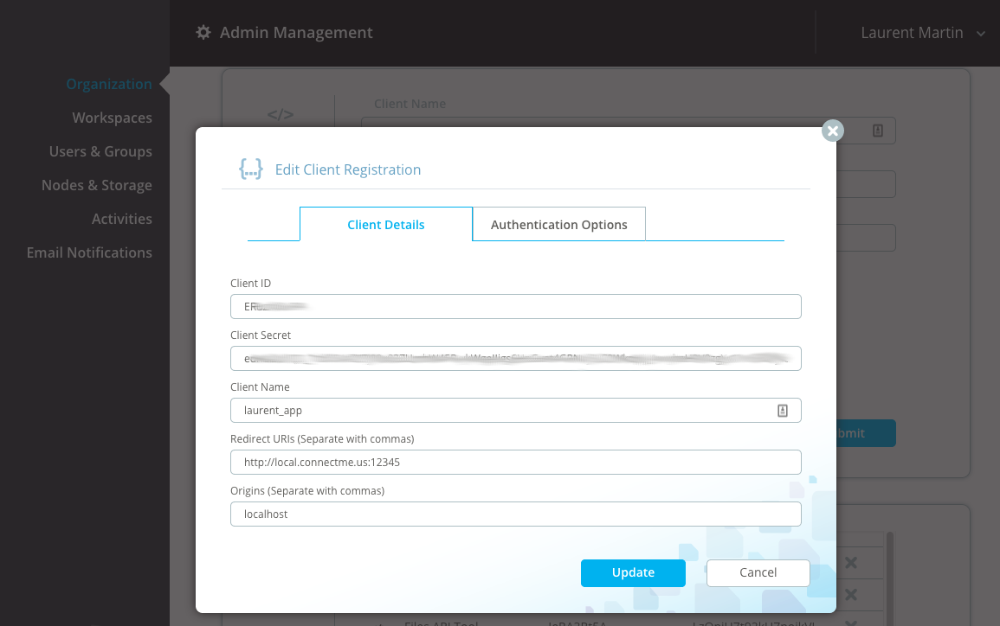
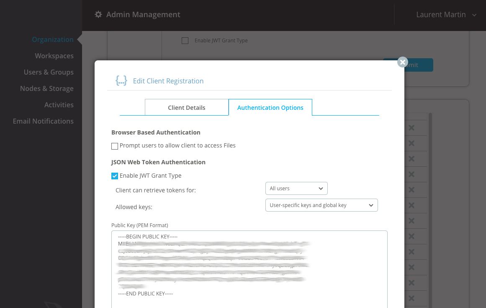

# Asperalm - Laurent's Aspera CLI and Ruby library

Laurent/2016

This Gem provides a cross platform (ruby based) command line tool (CLI) using (mostly REST) 
APIs of Aspera Products: Server, Node, Shares, Faspex, Console, Orchestrator, Files, ATS.

Disclaimer: This GEM is not endorsed/supported by IBM/Aspera, use at your risk, and not in 
production environments.

That being said, it is very powerful and gets things done, it's also a great tool to learn Aspera APIs.

# Overview, Features

This is a Ruby Gem that provides the following features:

* Supports most Aspera server products (on-premise and SaaS)
* Configuration file for products URLs and credentials (and any parameter)
* FASP transfer agent can be: FaspManager (local ascp), or Connect Client, or a transfer node
* Transfer parameters can be altered by modification of transferspec, this includes requiring multi-session transfer on nodes
* Allows transfers from products to products, essentially at node level
* Supports FaspStream creation (using Node API)
* Additional command plugins can be written by the user
* Parameter values can be passed on command line, in configuration file, in env var, in files
* Parameter values and command can be provided in short format (must be unique)
* Supports download of faspex "external" links
* Supports "legacy" ssh based FASP transfers and remote commands (ascmd)
* A FASPManager class for Ruby
* REST and OAuth classes for use with Aspera products APIs
* A command line tool: aslmcli

Ruby has been chosen as language as it is used in most Aspera products (consistency), and the 
interpret can be found for most platforms (portability).

This gem is provided as-is, and is not intended to be a complete CLI, or 
industry-grade product. This is a sample.
Aspera provides a CLI tool here: http://downloads.asperasoft.com/en/downloads/62 .

The CLI's folder where configuration and cache files are kept is `$HOME/.aspera/aslmcli`

Requires Ruby 2.0+

In examples below, command line operations (starting with "$") are shown using `bash`.

# Quick Start

## Pre-requisite : Ruby

First make sure that you have Ruby v2.0+ installed on your system.

### MacOS X
Ruby comes pre-installed on MacOSx. Nevertheless, installing new gems require admin privilege (sudo).
You may also install "homebrew", from here: https://brew.sh/, then do:

```bash
$ brew install ruby
```

### Windows
On windows you can get it from here: https://rubyinstaller.org/ .

### Linux
```bash
$ yum install ruby rubygems
```

## Installation
Once you have ruby and rights to install gems: Install the gem and its dependencies:

```bash
$ gem install asperalm
```
The tool can be used right away: `aslmcli`


## Installation of the FASP protocol

For any FASP based file transfer, the FASP protocol and a valid license id required. 
When the server side is
"connect" enabled, one can the the connect client license. The connect client can be installed
by visiting the page: http://downloads.asperasoft.com/connect2/

Alternatively, the connect client can be downloaded using the aslmcli, 
see section: [Download FASP](download-fasp).

## Configuration for Aspera Demo Server

```bash
$ aslmcli config id aspera_demo_server init @json:'{"url":"ssh://demo.asperasoft.com:33001","username":"asperaweb","password":"demoaspera"}'
$ aslmcli config id default set server aspera_demo_server 
$ aslmcli server browse /aspera-test-dir-large
$ aslmcli server download /aspera-test-dir-large/200MB .
```


## Configuration for Applications

For Faspex, Shares, Node (including ATS, Aspera Transfer Service), Console, 
only username/password and url are required (either on command line, or from config file). 
Those can usually be provided on the command line:

```bash
$ aslmcli shares browse / --url=https://10.25.0.6 --username=john --password=4sp3ra 
```

This can also be provisioned in a config file:

```bash
1$ aslmcli config id shares06 set url https://10.25.0.6
2$ aslmcli config id shares06 set username john
3$ aslmcli config id shares06 set password 4sp3ra
4$ aslmcli config id default set shares shares06 
5$ aslmcli config show
```

The three first commands build a configuration profile. 
Note that this can also be done with one command:

```bash
$ aslmcli config id shares06 init @json:'{"url":"https://10.25.0.6","username":"john","password":"4sp3ra"}'
```

The fourth command defines this profile as the default profile for the 
specified application. The last command dumps the configuration file. 
Alternative profiles can be used with option "-P&lt;profile&gt;"
(or --load-params=&lt;profile&gt;)


## Configuration for Aspera Files

Aspera Files APIs does not support Basic HTTP authentication (see section "Authentication").
Using the CLI with Aspera Files will require the generation of a "Bearer token", this is done
by default by authentication with a web interface (see section "Graphical interactions").

A more convenient way to use the CLI with Aspera Files, a possibility is to do the following 
(JWT auth):

* Create a private/public key pair, as specified in section: "Private/Public Keys"

* Register a new application in the Aspera Files Admin GUI (refer to section "Authentication"). 
Here, use the contents of this file (generated in step 2) for public key:
 `$HOME/.aspera/aslmcli/filesapikey.pub`

* set your Aspera Files default parameters:

```bash
$ aslmcli config id default set files files_myorg
$ aslmcli config id files_myorg set url https://myorg.asperafiles.com
$ aslmcli config id files_myorg set client_id MyClIeNtKeY
$ aslmcli config id files_myorg set client_secret MyClIeNtSeCrEtMyClIeNtSeCrEt
$ aslmcli config id files_myorg set username user@example.com
$ aslmcli config id files_myorg set private_key @val:@file:~/.aspera/aslmcli/filesapikey
```

* CLI is ready to use:

```bash
$ aslmcli files repo browse /
:..............................:........:................:...........:......................:..............:
:             name             :  type  : recursive_size :   size    :    modified_time     : access_level :
:..............................:........:................:...........:......................:..............:
: Summer 2016 Training         : link   :                :           : 2016-07-25T15:21:22Z : edit         :
: Laurent Garage SE            : folder : 19316893       :           :                      : edit         :
: Italy Training               : folder : 312068540      :           :                      : edit         :
: Cheese pile.jpeg             : file   :                : 9824      : 2016-11-16T12:10:25Z : edit         :
: Aspera Video                 : folder : 122237276      :           :                      : edit         :
:..............................:........:................:...........:......................:..............:

```

# Option and Argument values

The value for options (--option-name=VALUE) and command arguments are normally processed directly 
from the command line, i.e. `aslmcli command --option-name=VAL1 VAL2` takes "VAL1" as the value for
option "option_name", and "VAL2" as the value for first argument.

It is also possible to retrieve a value with the following special prefixes:

* @val:VALUE , just take the specified value, e.g. --username=@val:laurent, allows for meta characters
* @file:PATH , read value from a file (prefix "~/" is replaced with $HOME), e.g. --key=@file:$HOME/.ssh/mykey
* @env:ENVVAR , read from a named env var, e.g.--password=@env:MYPASSVAR

In addition it is possible to decode some values by prefixing :

* @base64: to decode base64 encoded string
* @json: to decode JSON values
* @zlib: to uncompress data

Example:

```bash
@zlib:@base64:@file:myfile.dat
```
This will read the content of the specified file, then, base64 decode, then unzip.

The special option "--" stop option processing, so following values are taken as arguments.

Environment variable starting with prefix: ASLMCLI_ are taken as option values, i.e. ASLMCLI_OPTION_NAME is for --option-name.

# Plugins and applications

The tools uses a plugin mechanism. Each plugin usually represent commands sent to a specific application.
For instance, the plugin "faspex" allows operations on the application "Aspera Faspex".

# Configuration file

The use of the configuration file is not mandatory. All parameters can be set on 
command line. A configuration file provides a way to define default values, especially
for authentication parameters, thus avoiding to always have to specify those parameters
on the command line.

The default configuration file is: `$HOME/.aspera/aslmcli/config.yaml` 
(can be overriden with option --config-file).
It is composed with "profiles" containing "parameters".
(The first level is an associative array whose values are associative arrays or parameters).

A good practice is to not manually edit this file and use modification commands.
If necessary, the configuration file can be edited with:

```bash
$ aslmcli config open
```

The configuration file can be modified using the commands:

```
aslmcli config id <profile name> set|delete|show|initialize
```

Two profiles are reserved:

* "config" is reserved for the global parameters of the `aslmcli` tool.
It contains a special parameter: "version" showing the CLI 
version used to create this file. It is used to check compatibility.
* "default" is reserved to define the default profile name used for plugins.

Usually, a configuration "profile" corresponds to a set of parameters used for a specific plugin.

The configuration file is a hash in a YAML file. Example:

```yaml
config:
  version: 0.3.7
  loglevel: debug
default:
  faspex: myfaspexprofile
myfaspexprofile:
  url: https://faspex.my.org/aspera/faspex
  username: admin
  password: MyPassword
```

* The configuration was created with CLI version 0.3.7
* the log level is set to "debug"
* the default profile to load for plugin "faspex" is : myfaspexprofile
* the profile "myfaspexprofile" defines some parameters: the URL and credentials
This specifies a profile called "myapp" and defines some default values for some
parameters.


A configuration file is located:

* if a parameter --config-file is specified, this defines the configuration file to use
* else the default file is used: $HOME/.aspera/aslmcli/config.yaml

Default parameters are loaded using this algorithm:

* if option '--load-params=xxxx' is specified (or -Pxxxx), this reads the profile specified
    * else if option --no-default is specified, then dont load default
    * else it looks for the name of the default profile name in section "default" and loads all parameters in this section
* environment variables are evaluated
* command line options are evaluated

A parameter value can be specified with the same syntax as section "Option and Argument values"

Parameters are evaluated in the order of command line.

To avoid loading the default parameter set for a plugin, just specify a non existing configuration: `-Pnone`

On command line, words in parameter names are separated by a dash, in configuration file, separator
is an underscore. E.g. --transfer-name  on command line gives transfer_node in configuration file.

Note: before version 0.4.5, some keys could be ruby symbols, from 0.4.5 all keys are strings. To
convert olver versions, remove the leading ":" in fronty of keys.

# Learning Aspera Product APIs (REST)

This CLI uses REST APIs.
To display HTTP calls, use argument `-r` or `--rest-debug`, this is useful to display 
exact content or HTTP requests and responses.

In order to get traces of execution, use argument : `--log-level=debug`

# Authentication

## Aspera Faspex / Shares / Console / Node

Only Basic authentication is supported. A "username" and "password" are provided, 
either on command line (--username, --password) or in the configuration file.

## Aspera Files

Aspera Files supports a more powerful and secure authentication mechanism: Oauth. 
HTTP Basic authentication is not supported (deprecated).

With OAuth, the application (aslmcli) must be identified, and a valid Aspera Files 
user must be used to access Aspera Files. Then a "Bearer" token is used for 
HTTP authentication.

First the application (aslmcli) must be declared in the Files GUI 
(see https://aspera.asperafiles.com/helpcenter/admin/organization/registering-an-api-client ). 
By declaring the application, a "client\_id" and "client\_secret" are generated:



It is possible to use the Aspera Files API, but a web browser is required to generate the token. 
`aslmcli` will either display the URL to be entered in a local browser, or open 
a browser directly (various options are proposed).

It is also possible to enable browser-less authentication by using JWT, in this 
case a private/public key pair is required (see section: Generating a key pair), 
the public key is provided to Aspera Files:



Upon successful authentication, auth token are saved (cache) in local files, and 
can be used subsequently. Expired token can be refreshed.

# Graphical interactions: Browser and Text Editor

Some actions may require the use of a graphical tool:

* a browser for Aspera Files authentication
* a text editor for configuration file edition

By default the CLI will assume that a graphical environment is available on windows,
and on other systems, rely on the presence of the "DISPLAY" environment variable.
It is also possible to force the graphical mode with option --gui-mode :

* `--gui-mode=graphical` forces a graphical environment, a browser will be opened for URLs or
a text editor for file edition.
* `--gui-mode=text` forces a text environment, the URL or file path to open is displayed on
terminal.

# Private/Public Keys

In order to use JWT for Aspera Files API client authentication, 
a private/public key pair must be generated.

For example, generate a passphrase-less keypair with `ssh-keygen`:

```bash
$ ssh-keygen -t rsa -f ~/.aspera/aslmcli/filesapikey -N ''
```

One can also use the "openssl" utility:
(on some openssl implementation there is option: -nodes (no DES))

```bash
$ APIKEY=~/.aspera/aslmcli/filesapikey
$ openssl genrsa -passout pass:dummypassword -out ${APIKEY}.protected 2048
$ openssl rsa -passin pass:dummypassword -in ${APIKEY}.protected -out ${APIKEY}
$ openssl rsa -pubout -in ${APIKEY} -out ${APIKEY}.pub
$ rm -f ${APIKEY}.protected
```

Or simply use the CLI:

```bash
$ aslmcli config genkey ~/.aspera/aslmcli/filesapikey
```

# FASP agents

The CLI provides access to Aspera Applications functions through REST APIs, it also
allows FASP based transfers (upload and download).

Any FASP parameter can be set by changing parameters in the associated "transfer spec".
The CLI standadizes on the use of "transfer spec" and does not support directly ascp options.
It is nevertheless possible to add ascp options (for fasp manager only, but not node api or connect)
using the special transfer spec parameter: EX_ascp_args.

Three Transfer agents are currently supported to start transfers :

## FASPManager API based (command line)

By default the CLI will use the Aspera Connect Client FASP part, in this case
it requires the installation of the Aspera Connect Client to be 
able to execute FASP based transfers. The CLI will try to automatically locate the 
Aspera Protocol (`ascp`). This is option: `--transfer=ascp`. Note that parameters
are always provided with a "transfer spec".

## Aspera Connect Client GUI

By specifying option: `--transfer=connect`, the CLI will start transfers in the Aspera
Connect Client.

## Aspera Node API : Node to node transfers

By specifying option: `--transfer=node`, the CLI will start transfers in an Aspera
Transfer Server using the Node API. The client node configuration shall be specified with:
`--transfer-node=<node config name>`

# FASP transfer parameters : transfer spec

## Destination folder for transfers

Use parameter --to-folder=_dst_path_ to set destination folder on download or upload.
By default destination is "." for downloads, and "/" for uploads.
Note that it is equivalent to setting "destination_root" in transfer spec
using option --ts=@json:'{"destination_root":"_dst_path_"}'

## Examples

Transfer parameters are contained in a "transfer spec", an associative array.
Changing a transfer spec is done by providing parameters in a JSON syntax.
For instance to override the FASP SSH port to a specific TCP port:

```
--ts=@json:'{"ssh_port":12345}'
```

To force http fallback mode:

```
--ts=@json:'{"http_fallback":"force"}'
```

In Node based transfers, Multi-session is available, simply add `--ts=@json:'{...}'`:

```bash
--ts=@json:'{"multi_session":10,"multi_session_threshold":1,"target_rate_kbps":500000,"checksum_type":"none","cookie":"custom:aslmcli:Laurent:My Transfer"}'
```


## Parameter list

All standard transfer spec parameter can be overloaded. To display parameter,
run in debug mode (--log-level=debug). Transfer spec can also be saved/overridden in
the config file.

(UNDER CONSTRUCTION <a href="https://developer.asperasoft.com/web/node/ops-transfers">ref</a>)

* F=Fasp Manager(local FASP execution)
* N=remote node(node API)
* C=Connect Client(web plugin)

Req/Def : Required or default value (- means emty)

Fields with EX_ prefix are specific to aslmcli in local mode.

arg: related ascp argument or env var suffix (PASS for ASPERA_SCP_PASS)

<style type="text/css">
table {border-collapse: collapse;}
table, th, td {border: 1px solid black;}
.yes {color:white;background-color:green;font-weight:bold;}
.no  {color:white;background-color:red;font-weight:bold;}
</style>
<table>
<tr><th>Field</th><th>Req/Def</th><th>Type</th><th>F</th><th>N</th><th>C</th><th>arg</th><th>Description</th></tr>
<tr><td>title</td><td>-</td><td>string</td><td class="no">N</td><td class="yes">Y</td><td class="yes">Y</td><td>-</td><td>Title of the transfer</td></tr>
<tr><td>tags</td><td>-</td><td>hash</td><td class="yes">Y</td><td class="yes">Y</td><td class="yes">Y</td><td>--tags<br>--tags64</td><td>Metadata for transfer</td></tr>
<tr><td>token</td><td>-</td><td>string</td><td class="yes">Y</td><td class="yes">Y</td><td class="yes">Y</td><td>TOKEN<br/>-W</td><td>Authorization token: Bearer, Basic or ATM</td></tr>
<tr><td>cookie</td><td>-</td><td>string</td><td class="yes">Y</td><td class="yes">Y</td><td class="yes">Y</td><td>COOKIE</td><td>Metadata for transfer (older,string)</td></tr>
<tr><td>direction</td><td>Required</td><td>string</td><td class="yes">Y</td><td class="yes">Y</td><td class="yes">Y</td><td>--mode</td><td>Direction: "send" or "receive"</td></tr>
<tr><td>remote_host</td><td>Required</td><td>string</td><td class="yes">Y</td><td class="yes">Y</td><td class="yes">Y</td><td>--host</td><td>IP or fully qualified domain name of the remote server</td></tr>
<tr><td>remote_user</td><td>Required</td><td>string</td></td><td class="yes">Y</td><td class="yes">Y</td><td class="yes">Y</td><td>--user</td><td>Remote user. Default value is "xfer" on node or connect.</td></tr>
<tr><td>remote_access_key</td><td>TODO</td><td>string</td><td></td><td></td><td></td><td>?</td><td>Node only?</td></tr>
<tr><td>source_root</td><td>-</td><td>string</td><td></td><td></td><td></td><td>--source-prefix<br/>--source-prefix64</td><td>Source root directory.(TODO: verify option)</td></tr>
<tr><td>destination_root</td><td>Required</td><td>string</td><td></td><td></td><td></td><td>last arg</td><td>Destination root directory.</td></tr>
<tr><td>fasp_port</td><td></td><td>integer</td></td><td class="yes">Y</td><td class="yes">Y</td><td class="yes">Y</td><td>-O</td><td>Specifies fasp (UDP) port.</td></tr>
<tr><td>ssh_port</td><td></td><td>integer</td></td><td class="yes">Y</td><td class="yes">Y</td><td class="yes">Y</td><td>-P</td><td>Specifies ssh (TCP) port.</td></tr>
<tr><td>rate_policy</td><td></td><td>string</td><td></td><td></td><td></td><td>--policy</td><td>Valid literals include "low","fair","high" and "fixed".</td></tr>
<tr><td>symlink_policy</td><td>follow</td><td>string</td><td></td><td></td><td></td><td>--symbolic-links</td><td>copy, follow, copy+force, skip.  Default is follow.  Handle source side symbolic links by following the link (follow), copying the link itself (copy),  skipping (skip), or forcibly copying the link itself (copy+force).</td></tr>
<tr><td>target_rate_kbps</td><td>-</td><td>integer</td><td></td><td></td><td></td><td>-l</td><td>Specifies desired speed for the transfer.</td></tr>
<tr><td>min_rate_kbps</td><td>0</td><td>integer</td><td></td><td></td><td></td><td>-m</td><td>Set the minimum transfer rate in kilobits per second.</td></tr>
<tr><td>cipher</td><td>none</td><td>string</td><td></td><td></td><td></td><td>-c</td><td>in transit encryption type.<br/>none, aes-128, aes-256</td></tr>
<tr><td>content_protection</td><td>-</td><td>string</td><td></td><td></td><td></td><td>--file-crypt</td><td>Valid literals include "encrypt" and "decrypt".</td></tr>
<tr><td>content_protection_password</td><td>-</td><td>string</td><td></td><td></td><td></td><td>PASS</td><td>Specifies a string password.</td></tr>
<tr><td>overwrite</td><td>diff</td><td></td><td></td><td></td><td></td><td>--overwrite</td><td>Overwrite destination files with the source files of the same name.<br/>never, always, diff, older, or diff+older</td></tr>
<tr><td>retry_duration</td><td></td><td>string</td><td></td><td></td><td></td><td>TODO</td><td>Specifies how long to wait before retrying transfer. (e.g. "5min")</td></tr>
<tr><td>http_fallback</td><td></td><td>integer</td><td></td><td></td><td></td><td>-y<br/>TODO</td><td>When true(1), attempts to perform an HTTP transfer if a fasp transfer cannot be performed.</td></tr>
<tr><td>create_dir</td><td></td><td>boolean</td><td></td><td></td><td></td><td>-d</td><td>Specifies whether to create new directories.</td></tr>
<tr><td>precalculate_job_size</td><td></td><td>boolean</td><td></td><td></td><td></td><td>Specifies whether to precalculate the job size.</td></tr>
<tr><td>delete_source</td><td></td><td>boolean</td><td></td><td></td><td></td><td>-</td></tr>
<tr><td>remove_after_transfer</td><td></td><td>boolean</td><td></td><td></td><td></td><td>Specifies whether to remove file after transfer.</td></tr>
<tr><td>remove_empty_directories</td><td></td><td>boolean</td><td></td><td></td><td></td><td>Specifies whether to remove empty directories.</td></tr>
<tr><td>multi_session</td><td></td><td>integer</td><td></td><td></td><td></td><td>Specifies how many parts the transfer is in.</td></tr>
<tr><td>multi_session_threshold</td><td></td><td>integer</td><td></td><td></td><td></td><td>in bytes</td></tr>
<tr><td>dgram_size</td><td></td><td>integer</td><td></td><td></td><td></td><td>in bytes</td></tr>
<tr><td>compression</td><td></td><td>integer</td><td></td><td></td><td></td><td>0 / 1?</td></tr>
<tr><td>read_threads</td><td></td><td>integer</td><td></td><td></td><td></td><td>-</td></tr>
<tr><td>write_threads</td><td></td><td>integer</td><td></td><td></td><td></td><td>-</td></tr>
<tr><td>use_ascp4</td><td></td><td>boolean</td><td></td><td></td><td></td><td>-</td></tr>
<tr><td>paths</td><td></td><td>array</td><td></td><td></td><td></td><td>positional<br/>--file-list<br/>--file-pair-list</td><td>Contains a path to the source (required) and a path to the destination.</td></tr>
<tr><td>http_fallback_port</td><td></td><td>integer</td><td></td><td></td><td></td><td>Specifies http port.</td></tr>
<tr><td>https_fallback_port</td><td></td><td>integer</td><td></td><td></td><td></td><td>Specifies https port.</td></tr>
<tr><td>cipher_allowed</td><td></td><td>string</td><td></td><td></td><td></td><td>Valid literals include "aes-128" and "none".</td></tr>
<tr><td>target_rate_cap_kbps</td><td></td><td></td><td></td><td></td><td></td><td>TODO</td><td>Specifies rate restrictions for the transfer.</td></tr>
<tr><td>rate_policy_allowed</td><td></td><td></td><td></td><td></td><td></td><td>Specifies most aggressive rate policy that is allowed. Valid literals include "low", "fair","high" and "fixed".</td></tr>
<tr><td>ssh_private_key</td><td></td><td>string</td><td></td><td></td><td></td><td>-</td></tr>
<tr><td>password</td><td></td><td>string</td><td class="yes">Y</td><td></td><td class="yes">Y</td><td class="yes">Y</td></tr>
<tr><td>resume_policy</td><td>faspmgr:<br/>none<br/>other:<br/>sparse_csum</td><td>string</td><td></td><td></td><td></td><td>-k</td><td>none,attrs,sparse_csum,full_csum</td></tr>
<tr><td>EX_ssh_key_value</td><td>-</td><td>string</td><td class="yes">Y</td><td class="no">N</td><td class="no">N</td><td>KEY</td><td>Private key used for SSH authentication</td></tr>
<tr><td>EX_ssh_key_paths</td><td>-</td><td>array</td><td class="yes">Y</td><td class="no">N</td><td class="no">N</td><td>-i</td><td>Use public key authentication and specify the private key file</td></tr>
<tr><td>EX_fallback_key</td><td>-</td><td>array</td><td class="yes">Y</td><td class="no">N</td><td class="no">N</td><td>-Y</td><td>The HTTPS transfer's key file name</td></tr>
<tr><td>EX_fallback_cert</td><td>-</td><td>array</td><td class="yes">Y</td><td class="no">N</td><td class="no">N</td><td>-I</td><td>The HTTPS certificate's file name</td></tr>
<tr><td>EX_at_rest_password</td><td>-</td><td>array</td><td class="yes">Y</td><td class="no">N</td><td class="no">N</td><td>FILEPASS</td><td>Passphrase used for at rest encryption or decryption</td></tr>
<tr><td>EX_proxy_password</td><td>-</td><td>array</td><td class="yes">Y</td><td class="no">N</td><td class="no">N</td><td>PROXY_PASS</td><td>TODO</td></tr>
<tr><td>EX_quiet</td><td>-</td><td>array</td><td class="yes">Y</td><td class="no">N</td><td class="no">N</td><td>-q</td><td>Quiet flag, disable progress display</td></tr>
<tr><td>EX_fasp_proxy_url</td><td>-</td><td>array</td><td class="yes">Y</td><td class="no">N</td><td class="no">N</td><td>--proxy</td><td>Specify the address of the Aspera high-speed proxy server</td></tr>
<tr><td>EX_http_proxy_url</td><td>-</td><td>array</td><td class="yes">Y</td><td class="no">N</td><td class="no">N</td><td>-x</td><td>Specify the proxy server address used by HTTP Fallback</td></tr>
<tr><td>EX_ascp_args</td><td>-</td><td>array</td><td class="yes">Y</td><td class="no">N</td><td class="no">N</td><td>same</td><td>Add command line arguments to ascp</td></tr>
</table>

# FASP Stream
It is possible to start a FASPStream session using the node API:

Use the "node stream create" command, then arguments are provided as a "transfer spec".

```bash
./bin/aslmcli node stream create --ts=@json:'{"direction":"send","source":"udp://233.3.3.4:3000?loopback=1&ttl=2","destination":"udp://233.3.3.3:3001/","remote_host":"localhost","remote_user":"stream","password":"XXXX"}' --load-params=stream
```

# Download FASP
The CLI allows download of the FASP protocol in connect client :

```bash
$ ./bin/aslmcli client connect list
:...............................................:......................................:..............:
:                      id                       :                title                 :   version    :
:...............................................:......................................:..............:
: urn:uuid:589F9EE5-0489-4F73-9982-A612FAC70C4E : Aspera Connect for Windows           : 3.7.0.138427 :
: urn:uuid:A3820D20-083E-11E2-892E-0800200C9A66 : Aspera Connect for Windows 64-bit    : 3.7.0.138427 :
: urn:uuid:589F9EE5-0489-4F73-9982-A612FAC70C4E : Aspera Connect for Windows XP        : 3.7.0.138427 :
: urn:uuid:55425020-083E-11E2-892E-0800200C9A66 : Aspera Connect for Windows XP 64-bit : 3.7.0.138427 :
: urn:uuid:D8629AD2-6898-4811-A46F-2AF386531BFF : Aspera Connect for Mac Intel 10.6    : 3.6.1.111259 :
: urn:uuid:D8629AD2-6898-4811-A46F-2AF386531BFF : Aspera Connect for Mac Intel         : 3.7.0.138427 :
: urn:uuid:213C9370-22B1-11E2-81C1-0800200C9A66 : Aspera Connect for Linux 32          : 3.6.2.117442 :
: urn:uuid:97F94DF0-22B1-11E2-81C1-0800200C9A66 : Aspera Connect for Linux 64          : 3.7.2.141527 :
:...............................................:......................................:..............:
$ aslmcli client connect id 'Aspera Connect for Mac Intel 10.6' links list
:.............................................:..........................:.......................................................................:..........:...............:
:                    title                    :           type           :                                 href                                  : hreflang :      rel      :
:.............................................:..........................:.......................................................................:..........:...............:
: Mac Intel Installer                         : application/octet-stream : bin/AsperaConnect-3.6.1.111259-mac-intel-10.6.dmg                     : en       : enclosure     :
: Aspera Connect for Mac HTML Documentation   : text/html                :                                                                       : en       : documentation :
: Aspera Connect PDF Documentation for Mac OS : application/pdf          : docs/user/osx/ja-jp/pdf/Connect_User_3.7.0_OSX_ja-jp.pdf              : ja-jp    : documentation :
: Aspera Connect PDF Documentation for Mac OS : application/pdf          : docs/user/osx/en/pdf/Connect_User_3.7.0_OSX.pdf                       : en       : documentation :
: Aspera Connect PDF Documentation for Mac OS : application/pdf          : docs/user/osx/es-es/pdf/Connect_User_3.7.0_OSX_es-es.pdf              : es-es    : documentation :
: Aspera Connect PDF Documentation for Mac OS : application/pdf          : docs/user/osx/fr-fr/pdf/Connect_User_3.7.0_OSX_fr-fr.pdf              : fr-fr    : documentation :
: Aspera Connect PDF Documentation for Mac OS : application/pdf          : docs/user/osx/zh-cn/pdf/Connect_User_3.7.0_OSX_zh-cn.pdf              : zh-cn    : documentation :
: Aspera Connect for Mac Release Notes        : text/html                : http://www.asperasoft.com/en/release_notes/default_1/release_notes_54 : en       : release-notes :
:.............................................:..........................:.......................................................................:..........:...............:
$ aslmcli client connect id 'Aspera Connect for Mac Intel 10.6' links id 'Mac Intel Installer' download .
downloaded: AsperaConnect-3.6.1.111259-mac-intel-10.6.dmg
```

# Transfer filter

special in node:

```
"transfer_filter"=>"t['status'].eql?('completed') and t['start_spec']['remote_user'].eql?('faspex')", :file_filter=>"f['status'].eql?('completed') and 0 != f['size'] and t['start_spec']['direction'].eql?('send')"
```

# Examples

## SHOD to ATS

Access to a "Shares on Demand" (SHOD) server on AWS is provided by a partner. And we need to 
transfer files from this third party SHOD instance into our Azure BLOB storage.
Simply create an "Aspera Transfer Service" instance (https://ts.asperasoft.com), which
provides access to the node API.
Then create a configuration for the "SHOD" instance in the configuration file: in section 
"shares", a configuration named: awsshod.
Create another configuration for the Azure ATS instance: in section "node", named azureats.
Then execute the following command:
```bash
aslmcli node download /share/sourcefile /destinationfolder --load-params=awsshod --transfer=node --transfer-node=azureats
```
This will get transfer information from the SHOD instance and tell the Azure ATS instance 
to download files.


# Create your own plugin
```bash
$ mkdir -p ~/.aspera/aslmcli/plugins
$ cat<<EOF>~/.aspera/aslmcli/plugins/test.rb
require 'asperalm/cli/plugin'
module Asperalm
  module Cli
    module Plugins
      class Test < Plugin
        def declare_options; end
        def action_list; [];end
        def execute_action; puts "Hello World!"; end
      end # Test
    end # Plugins
  end # Cli
end # Asperalm
EOF
```
# Faspex remote sources

Faspex lacks an API to list the contents of a remote source (available in web UI). To workaround this,
the node API is used, for this it is required to add a section ":storage" that links
a storage name to a node config and sub path. Example:
```yaml
my_faspex_conf:
  url: https://10.25.0.3/aspera/faspex
  username: admin
  password: MyPassword
  storage:
    testlaurent:
      node: my_faspex_node
      :path: /myfiles
my_faspex_node:
  url: https://10.25.0.3:9092
  username: node_faspex
  password: MyPassword
```

In this example, a faspex storage named "testlaurent" exists in Faspex, and is located
under the docroot in "/myfiles" (this must be the same as configured in Faspex).
The node configuration name is "my_faspex_node" here.

# Aspera Transfer Service

The user shall have an Aspera ID, this allows the creation of an "ats id". To avoid having tho specify this id on each command, the user can define a configuration profile for this default parameter: --ats-id for plugin ats.


several operations available. example: create access key:

```
create an access key:
aslmcli ats access_key create --cloud=SOFTLAYER --region=ams --params=@json:'{"storage":{"type":"softlayer_swift","container":"_container_name_","credentials":{"api_key":"value","username":"_name_:_usr_name_"},"path":"/"},"id":"_optional_id_","name":"_optional_name_"}'

delete all my access keys:
for k in $(aslmcli ats access_key list --field=id --format=csv);do aslmcli ats access_key id $k delete;done
```

# Sample commands
Some commands used in unit testing:
```bash
<%= File.read(ENV["COMMANDS"]) %>
...and more
```

# Usage

```bash
$ aslmcli -h
<%= File.read(ENV["USAGE"]) %>

```

Note that actions and parameter values can be written in short form.

# BUGS
This is a sample code only, dont expect full capabilities. This code is not
supported by IBM/Aspera. You can contact the author.

If you get message: "OpenSSH keys only supported if ED25519 is available"
this means that you do not have ruby support for ED25519 SSH keys. You may either install the suggested
Gems, or remove your ed25519 key to solve the issue.


# TODO
* remove rest and oauth and use ruby standard gems:

  * oauth
  * https://github.com/rest-client/rest-client

use tools from:
http://blog.excelwithcode.com/build-commandline-apps.html

* provide metadata in packages

* deliveries to dropboxes

# Contributing

Create your own plugin !

Send comments !

