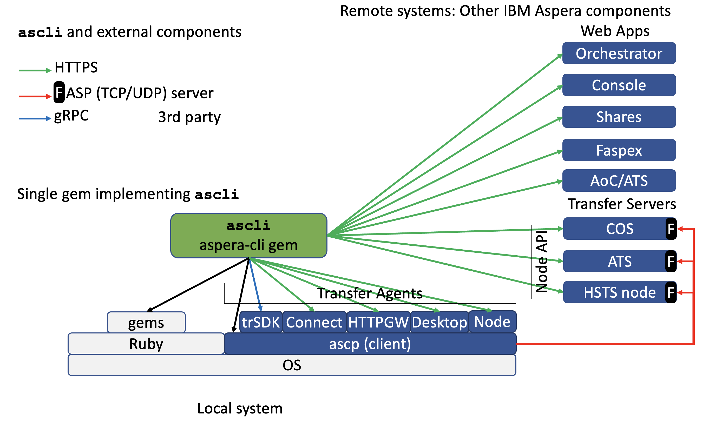

# Architecture Documentation

## Overview

The IBM Aspera CLI (`ascli`) is a Ruby-based command-line interface that provides unified access to IBM Aspera's high-speed file transfer products and services. The architecture follows a modular, plugin-based design that separates concerns between command processing, API communication, and transfer execution.

## System Architecture



The architecture diagram illustrates the layered structure of `ascli` and its interactions with external components.

## Architectural Layers

### Local System Layer

The foundation layer consists of the local execution environment:

- **Operating System**: Cross-platform support (Linux, macOS, Windows)
- **Ruby Runtime**: Ruby ≥ 3.1 interpreter
- **Ruby Gems**: Third-party dependencies managed via Bundler
- **Transfer Agents**: Multiple FASP client implementations
  - `ascp` (client): The core FASP protocol implementation
  - Transfer SDK (trSDK): gRPC-based transfer daemon
  - Connect: Browser-based transfer client
  - HTTPGW: HTTP Gateway for firewall-friendly transfers
  - Desktop: Aspera Desktop Client integration
  - Node: Direct Node API transfers

### Core Application Layer (`aspera-cli` gem)

The central green component in the diagram represents the Ruby gem that implements all CLI functionality.

#### Entry Point

**File**: [`bin/ascli`](../bin/ascli)

The main executable script that:

- Sets up UTF-8 encoding for internationalization
- Pre-parses early options (`--log-level`, `--log-format`, `--logger`) before full initialization
- Fixes the home directory on Windows via `Environment.instance.fix_home`
- Delegates to the main CLI processor

```ruby
#!/usr/bin/env ruby
require 'aspera/cli/runner'
Aspera::Environment.instance.fix_home
Aspera::Cli::Runner.new(ARGV).run
```

#### Runner and Context

**Files**: [`lib/aspera/cli/runner.rb`](../lib/aspera/cli/runner.rb), [`lib/aspera/cli/context.rb`](../lib/aspera/cli/context.rb)

The `Runner` class orchestrates the full command lifecycle:

- **`run`**: Main entry point — calls `run_with_result`, displays the result via `Formatter`, handles all exceptions, and exits with the appropriate status code.
- **`run_with_result`**: Pure computation entry point — initializes all agents and options, resolves the target plugin, executes the action, and returns a `Result` object. Raises on error. Used by the MCP server to run commands in-process.

All shared objects (options manager, transfer agent, config plugin, formatter, preset manager, HTTP config, etc.) are held in a `Context` instance and passed to plugins by reference.

#### CLI Options

**File**: [`lib/aspera/cli/options.rb`](../lib/aspera/cli/options.rb)

The `Cli::Options` class handles:

- **Option Parsing**: Command-line argument processing using `OptionParser`
- **Extended Value Syntax**: Support for complex parameter types (JSON, YAML, Ruby expressions, `@preset:`, `@vault:`, `@args:`)
- **Option Validation**: Type checking and value constraints
- **Configuration Management**: Integration with persistent configuration

Key responsibilities:

- Declare and validate CLI options
- Support for boolean, string, integer, array, hash types
- Handle sensitive data (passwords, secrets) with masking
- Provide option inheritance and defaults

#### Plugin System

**Directory**: [`lib/aspera/cli/plugins/`](../lib/aspera/cli/plugins/)

The plugin architecture enables modular command implementation for different Aspera products:

**Base Plugin** ([`base.rb`](../lib/aspera/cli/plugins/base.rb)):

- Defines standard CRUD operations: `create`, `list`, `modify`, `show`, `delete`
- Provides bulk operation support
- Implements resource identifier resolution (including percent-selector syntax)
- Manages plugin context (options, transfer agent, config, formatter)

**Product Plugins**:

- [`aoc.rb`](../lib/aspera/cli/plugins/aoc.rb) - Aspera on Cloud / ATS
- [`ats.rb`](../lib/aspera/cli/plugins/ats.rb) - Aspera Transfer Service
- [`faspex.rb`](../lib/aspera/cli/plugins/faspex.rb) - Faspex 4
- [`faspex5.rb`](../lib/aspera/cli/plugins/faspex5.rb) - Faspex 5
- [`shares.rb`](../lib/aspera/cli/plugins/shares.rb) - Aspera Shares
- [`node.rb`](../lib/aspera/cli/plugins/node.rb) - Node API
- [`console.rb`](../lib/aspera/cli/plugins/console.rb) - Aspera Console
- [`orchestrator.rb`](../lib/aspera/cli/plugins/orchestrator.rb) - Aspera Orchestrator
- [`server.rb`](../lib/aspera/cli/plugins/server.rb) - HSTS (High-Speed Transfer Server)
- [`cos.rb`](../lib/aspera/cli/plugins/cos.rb) - IBM Cloud Object Storage
- [`httpgw.rb`](../lib/aspera/cli/plugins/httpgw.rb) - HTTP Gateway
- [`faspio.rb`](../lib/aspera/cli/plugins/faspio.rb) - Fasp.io Gateway
- [`alee.rb`](../lib/aspera/cli/plugins/alee.rb) - Aspera Line Enterprise Edition

**Utility Plugins**:

- [`config.rb`](../lib/aspera/cli/plugins/config.rb) - Configuration management (includes `AscpActions`, `PresetActions`, `GemChecker`, `Mailer`, `VaultManager`, `SyncActions` mixins)
- [`preview.rb`](../lib/aspera/cli/plugins/preview.rb) - File preview generation
- [`oauth.rb`](../lib/aspera/cli/plugins/oauth.rb) - OAuth authentication
- [`mcp.rb`](../lib/aspera/cli/plugins/mcp.rb) - Model Context Protocol server (exposes `ascli` to AI assistants)

#### Transfer Agent Abstraction

**File**: [`lib/aspera/cli/transfer_agent.rb`](../lib/aspera/cli/transfer_agent.rb)

The Transfer Agent provides a unified interface for initiating transfers across different FASP clients:

**Responsibilities**:

- Abstract transfer initiation across multiple agent types
- Manage transfer specifications (transfer_spec)
- Handle file list sources (`@args`, `@ts`, arrays)
- Coordinate transfer progress monitoring
- Send transfer completion notifications

**Agent Base Class** ([`lib/aspera/agent/base.rb`](../lib/aspera/agent/base.rb)):

```ruby
class Base
  # Start a transfer asynchronously (must be implemented by subclass)
  def start_transfer(transfer_spec)

  # Wait for all transfers to complete and return per-session statuses (must be implemented)
  def wait_for_transfers_completion

  # Wait for completion and validate statuses (public API)
  def wait_for_completion

  # Optional: release resources
  def shutdown
end
```

**Supported Agents**:

- **Direct**: Direct `ascp` execution (default)
- **Connect**: Aspera Connect browser plugin
- **Node**: Node API-based transfers
- **HTTPGW**: HTTP Gateway for restricted networks
- **Desktop**: Aspera Desktop Client
- **Transfer Daemon (trSDK)**: gRPC-based transfer service ([`transferd.rb`](../lib/aspera/agent/transferd.rb))

### API Communication Layer

#### REST Client

**File**: [`lib/aspera/rest.rb`](../lib/aspera/rest.rb)

A custom HTTP client implementation providing:

- **HTTP Methods**: GET, POST, PUT, PATCH, DELETE, CANCEL
- **Authentication**: Basic, Bearer token, OAuth 2.0
- **Content Types**: JSON, form-encoded, multipart
- **Error Handling**: Automatic retry logic, error analysis
- **Progress Tracking**: File upload/download progress
- **Session Management**: Connection pooling, SSL/TLS configuration

Features:

- Automatic JSON parsing for API responses
- Custom error classes for different HTTP status codes
- Support for streaming large file transfers
- Configurable retry policies for transient failures

#### Node API Client

**File**: [`lib/aspera/api/node.rb`](../lib/aspera/api/node.rb)

Specialized client for Aspera Node API with:

- **Access Key Management**: Gen4 access key support
- **Bearer Token Generation**: JWT-based authentication
- **File Operations**: Browse, upload, download, delete
- **Permission Management**: Fine-grained access control
- **Transfer Spec Generation**: Automatic transfer parameter creation
- **Caching**: Optional Redis-based response caching

#### OAuth Implementation

**Directory**: [`lib/aspera/oauth/`](../lib/aspera/oauth/)

Modular OAuth 2.0 support:

- **Generic OAuth** ([`generic.rb`](../lib/aspera/oauth/generic.rb)): Standard OAuth 2.0 flows
- **JWT** ([`jwt.rb`](../lib/aspera/oauth/jwt.rb)): JSON Web Token authentication
- **Web** ([`web.rb`](../lib/aspera/oauth/web.rb)): Browser-based OAuth flows
- **URL JSON** ([`url_json.rb`](../lib/aspera/oauth/url_json.rb)): Token from URL

### FASP Transfer Layer

#### ASCP Installation Manager

**File**: [`lib/aspera/ascp/installation.rb`](../lib/aspera/ascp/installation.rb)

Singleton class managing `ascp` binary location and SDK resources:

- **Product Detection**: Automatically finds installed Aspera products
- **SDK Installation**: Downloads and installs Transfer SDK
- **Path Resolution**: Locates `ascp` executable and supporting files
- **SSH Key Management**: Handles client SSH keys for authentication

Supported product detection:

- Aspera Desktop Client
- Aspera Connect
- Aspera Transfer SDK (`transferd`)
- Aspera for Desktop
- Aspera HSTS/ATS installations

#### Transfer Specification

**File**: [`lib/aspera/transfer/spec.rb`](../lib/aspera/transfer/spec.rb)

Transfer specifications define all parameters for a FASP transfer:

- Source and destination paths
- Transfer direction (upload/download)
- Rate control (target rate, min rate, policy)
- Encryption settings
- Resume policies
- Authentication credentials
- Protocol options (UDP/TCP ports, SSH options)

### Remote Systems Layer

The CLI communicates with various IBM Aspera components:

#### Web Applications (HTTPS)

- **Aspera on Cloud (AoC)**: Cloud-based file sharing and collaboration
- **Aspera Transfer Service (ATS)**: Managed transfer service
- **Faspex**: Secure package exchange (v4 and v5)
- **Shares**: File sharing and synchronization
- **Console**: Central management console
- **Orchestrator**: Workflow automation

Communication via:

- REST APIs over HTTPS
- OAuth 2.0 authentication
- JSON request/response payloads

#### Transfer Servers (FASP Protocol)

- **IBM Cloud Object Storage (COS)**: S3-compatible object storage with FASP
- **Aspera Transfer Server (ATS)**: Dedicated transfer endpoints
- **HSTS Node**: High-Speed Transfer Server with Node API

Communication via:

- FASP protocol (TCP/UDP) for data transfer
- Node API (HTTPS) for control operations
- SSH for authentication and session management

#### Third-Party Integrations

- **gRPC**: Transfer Daemon communication
- **MCP**: Model Context Protocol for AI assistant integration
- **External Tools**: Integration with system utilities

## Data Flow

### Typical Command Execution Flow

1. **Command Parsing**:

   ```text
   User Input &rarr; bin/ascli &rarr; CLI Options &rarr; Option Parsing
   ```

2. **Plugin Selection**:

   ```text
   Command &rarr; Plugin Factory &rarr; Specific Plugin (e.g., aoc, faspex)
   ```

3. **API Communication**:

   ```text
   Plugin &rarr; REST Client &rarr; Remote API &rarr; JSON Response
   ```

4. **Transfer Initiation**:

   ```text
   Plugin &rarr; Transfer Agent &rarr; Agent Selection &rarr; ascp/trSDK/Connect
   ```

5. **Transfer Execution**:

   ```text
   Transfer Agent &rarr; FASP Protocol &rarr; Remote Server &rarr; Progress Updates
   ```

6. **Result Formatting**:

   ```text
   Response Data &rarr; Formatter &rarr; Output (table/json/yaml/csv)
   ```

## Key Design Patterns

### Plugin Architecture

Each Aspera product is implemented as a plugin inheriting from `Plugins::Base`:

- Consistent command structure across products
- Standard CRUD operations
- Extensible for product-specific features

### Factory Pattern

Used for creating instances based on configuration:

- **Agent Factory**: Selects appropriate transfer agent
- **OAuth Factory**: Creates authentication handlers
- **Plugin Factory**: Instantiates product plugins

### Singleton Pattern

Used for global configuration and state:

- **Installation**: ASCP binary location
- **RestParameters**: HTTP client settings
- **Log**: Logging configuration

### Strategy Pattern

Transfer agents implement a common interface with different strategies:

- Direct execution via `ascp`
- Browser-based via Connect
- API-based via Node
- Gateway-based via HTTPGW

### Template Method Pattern

Base plugin defines the operation flow, subclasses implement specifics:

```ruby
class Base
  def execute_action
    # Template method
  end
end

class Faspex < Base
  def execute_action
    # Faspex-specific implementation
  end
end
```

### Mixin / Module Pattern

Large classes are decomposed into focused mixins included by the host class:

- `Config` plugin includes `AscpActions`, `PresetActions`, `GemChecker`, `Mailer`, `VaultManager`, `SyncActions`
- Each mixin owns a single responsibility and depends on `options`, `context`, and other accessors provided by the host

## Configuration Management

### Configuration File

**Location**: `~/.aspera/ascli/config.yaml`

Stores:

- Preset configurations for different environments
- Default options and parameters
- Authentication credentials (encrypted)
- Transfer agent preferences

### Preset System

Presets allow saving commonly used option combinations:

```yaml
presets:
  my_aoc:
    url: https://mycompany.ibmaspera.com
    username: user@example.com
    password: "@vault:aoc_password"
```

### Secret Management

Integration with secure storage:

- **Keychain**: macOS Keychain integration
- **Vault**: HashiCorp Vault support
- **Encrypted Hash**: Built-in encryption

## Error Handling

### Error Hierarchy

```text
StandardError
├── Aspera::Cli::Error (CLI base)
│   ├── BadArgument
│   ├── MissingArgument
│   ├── NoSuchElement
│   └── BadIdentifier
├── RestCallError (HTTP errors)
└── Transfer::Error (transfer failures)
```

### Error Analysis

**File**: [`lib/aspera/rest_error_analyzer.rb`](../lib/aspera/rest_error_analyzer.rb)

Analyzes API errors and provides:

- Human-readable error messages
- Suggested remediation steps
- Context-specific guidance

## Logging and Debugging

### Log Levels

- `trace2`: Finest-grained tracing (most verbose)
- `trace1`: Fine-grained tracing
- `debug`: Detailed debugging information
- `info`: General informational messages
- `warn`: Warning messages
- `error`: Error messages
- `fatal`: Fatal errors
- `unknown`: Unknown severity

### Debug Features

- HTTP request/response logging
- Transfer specification display
- API call tracing
- Progress monitoring

## Testing Architecture

### Test Structure

**Directory**: [`tests/`](../tests/)

- Unit tests for individual components
- Integration tests for API interactions
- End-to-end transfer tests
- Mock servers for offline testing

### CI/CD Integration

GitHub Actions workflows:

- Multi-version Ruby testing (3.1, 3.2, 3.3, 3.4, JRuby)
- Automated smoke tests
- Code quality checks (RuboCop)
- Security scanning (CodeQL)

## Extension Points

### Adding a New Plugin

1. Create plugin file in `lib/aspera/cli/plugins/`
2. Inherit from `Plugins::Base`
3. Define `ACTIONS` constant
4. Implement `execute_action` method
5. Register in plugin factory

### Adding a New Transfer Agent

1. Create agent file in `lib/aspera/agent/`
2. Inherit from `Agent::Base`
3. Implement required methods:
   - `start_transfer`
   - `wait_for_transfers_completion`
4. Register in `Agent::Factory`

### Adding a New Output Format

1. Extend `Formatter` class
2. Implement format-specific rendering
3. Register format in formatter factory

## Performance Considerations

### Transfer Optimization

- **Multi-session**: Parallel transfer sessions for large files
- **Adaptive Rate**: Dynamic bandwidth adjustment
- **Resume**: Sparse checksum-based resume
- **Compression**: Optional in-flight compression

### API Optimization

- **Pagination**: Efficient handling of large result sets
- **Caching**: Optional response caching
- **Connection Pooling**: Reuse HTTP connections
- **Batch Operations**: Bulk create/delete operations

## Security Architecture

### Authentication Methods

1. **OAuth 2.0**: Token-based authentication
2. **JWT**: JSON Web Tokens
3. **Basic Auth**: Username/password
4. **SSH Keys**: Public key authentication
5. **Access Keys**: Node API access keys

### Credential Storage

- Encrypted configuration file
- System keychain integration
- Environment variables
- Vault integration

### Secure Communication

- TLS/SSL for HTTPS
- SSH for FASP control channel
- Encrypted FASP data transfer
- Certificate validation

## Deployment Models

### Installation Methods

1. **Ruby Gem**: `gem install aspera-cli`
2. **Single Executable**: Standalone binary
3. **Container**: Docker image
4. **Package Managers**: Homebrew, Chocolatey

### Runtime Requirements

- Ruby ≥ 3.1
- FASP client (ascp or Transfer SDK)
- Network connectivity
- Sufficient disk space for transfers

## Future Architecture Considerations

From [`CONTRIBUTING.md`](../CONTRIBUTING.md#L319-L325):

- Replace custom REST implementation with standard gems (`rest-client`)
- Replace custom OAuth with standard gem (`oauth2`)
- Integrate standard CLI framework (`thor`)
- Explore Traveling Ruby for distribution

## References

- [Main Documentation](README.md)
- [Contributing Guide](../CONTRIBUTING.md)
- [API Documentation](https://www.rubydoc.info/gems/aspera-cli)
- [IBM Aspera Documentation](https://www.ibm.com/docs/en/aspera)
